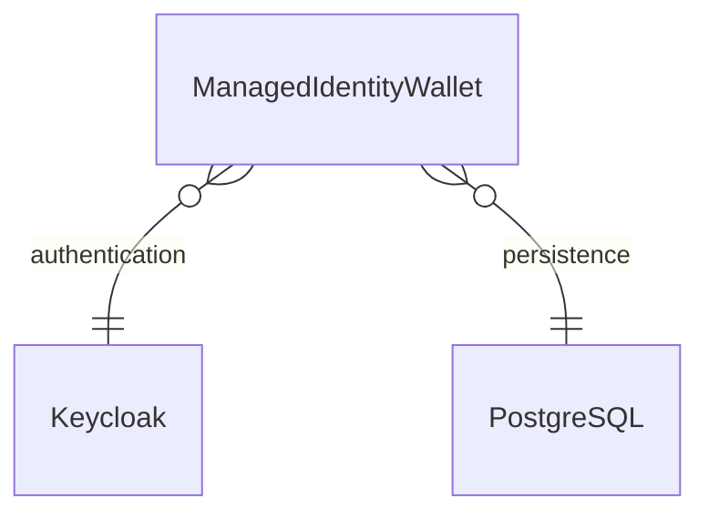

# managed-identity-wallet

  

Managed Identity Wallet is supposed to supply a secure data source and data sink for Digital Identity Documents (DID), in order to enable Self-Sovereign Identity founding on those DIDs.
And at the same it shall support an uninterrupted tracking and tracing and documenting the usage of those DIDs, e.g. within logistical supply chains.

**Homepage:** <https://github.com/eclipse-tractusx/managed-identity-wallet>

## Table of Contents

<!-- TABLE OF CONTENTS -->
<ol>
    <li><a href="#general-information">Helm Commands</a>
        <ul>
            <li><a href="#get-repo-info">Get Repository Info</a></li>
            <li><a href="#install-chart">Install Chart</a></li>
            <li><a href="#uninstall-chart">Uninstall Chart</a></li>
            <li><a href="#upgrading-chart">Upgrading Chart</a></li>
        </ul>
    </li>
    <li><a href="#requirements">Requirements</a></li>
    <li><a href="#values">Values</a></li>
    <li><a href="#deployment">Deployment</a></li>
    <li><a href="#configuration">Configuration</a></li>
</ol>

## Helm Commands

### Get Repository Info

    helm repo add tractusx-dev https://eclipse-tractusx.github.io/charts/dev
    helm repo update

    helm repo add tractusx-dev https://eclipse-tractusx.github.io/charts/stable
    helm repo update

(<a href="#readme-top">back to top</a>)

### Install Chart

    helm install [RELEASE_NAME] tractusx-dev/managed-identity-wallet

    helm install [RELEASE_NAME] tractusx-stable/managed-identity-wallet

(<a href="#readme-top">back to top</a>)

The command deploys miw on the Kubernetes cluster in the default configuration.

See configuration below.

See [helm install](https://helm.sh/docs/helm/helm_install/) for command documentation.

(<a href="#readme-top">back to top</a>)

### Uninstall Chart

    helm uninstall [RELEASE_NAME]

This removes all the Kubernetes components associated with the chart and deletes the release.

See [helm uninstall](https://helm.sh/docs/helm/helm_uninstall/) for command documentation.

(<a href="#readme-top">back to top</a>)

### Upgrading Chart

    helm upgrade [RELEASE_NAME] [CHART]

See [helm upgrade](https://helm.sh/docs/helm/helm_upgrade/) for command documentation.

(<a href="#readme-top">back to top</a>)

## Requirements

| Repository | Name | Version |
|------------|------|---------|
| file://charts/pgadmin4 | pgadmin4 | 1.19.0 |
| https://charts.bitnami.com/bitnami | common | 2.x.x |
| https://charts.bitnami.com/bitnami | keycloak | 15.1.6 |
| https://charts.bitnami.com/bitnami | postgresql | 11.9.13 |

(<a href="#readme-top">back to top</a>)

## Values

| Key | Type | Default | Description |
|-----|------|---------|-------------|
| affinity | object | `{}` | Affinity configuration |
| envs | object | `{}` | envs Parameters for the application (will be provided as environment variables) |
| extraVolumeMounts | list | `[]` |  |
| extraVolumes | list | `[]` | add volumes to the miw deployment |
| fullnameOverride | string | `""` | String to fully override common.names.fullname template |
| image.pullPolicy | string | `"Always"` | PullPolicy |
| image.repository | string | `"tractusx/managed-identity-wallet"` | Image repository |
| image.tag | string | `""` | Image tag (empty one will use "appVersion" value from chart definition) |
| imagePullSecrets | list | `[]` |  |
| ingress | object | `{"annotations":{},"className":"nginx","enabled":false,"hosts":[],"tls":[]}` | Ingress Configuration |
| ingress.annotations | object | `{}` | Ingress annotations |
| ingress.enabled | bool | `false` | Enable ingress controller resource |
| ingress.hosts | list | `[]` | Ingress accepted hostnames |
| ingress.tls | list | `[]` | Ingress TLS configuration |
| initContainers | list | `[]` | add initContainers to the miw deployment |
| keycloak | object | `{"auth":{"adminPassword":"","adminUser":"admin"},"enabled":true,"extraEnvVars":[],"ingress":{"annotations":{},"enabled":false,"hosts":[],"tls":[]},"keycloakConfigCli":{"backoffLimit":2,"enabled":true,"existingConfigmap":"keycloak-realm-config"},"postgresql":{"auth":{"database":"miw_keycloak","password":"defaultpassword","username":"miw_keycloak"},"enabled":true,"nameOverride":"keycloak-postgresql","volumePermissions":{"enabled":true}}}` | Values for KEYCLOAK |
| keycloak.auth.adminPassword | string | `""` | Keycloak admin password |
| keycloak.auth.adminUser | string | `"admin"` | Keycloak admin user |
| keycloak.enabled | bool | `true` | Enable to deploy Keycloak |
| keycloak.extraEnvVars | list | `[]` | Extra environment variables |
| keycloak.ingress.annotations | object | `{}` | Ingress annotations |
| keycloak.ingress.enabled | bool | `false` | Enable ingress controller resource |
| keycloak.ingress.hosts | list | `[]` | Ingress accepted hostnames |
| keycloak.ingress.tls | list | `[]` | Ingress TLS configuration |
| keycloak.keycloakConfigCli.backoffLimit | int | `2` | Number of retries before considering a Job as failed |
| keycloak.keycloakConfigCli.enabled | bool | `true` | Enable to create the miw playground realm |
| keycloak.keycloakConfigCli.existingConfigmap | string | `"keycloak-realm-config"` | Existing configmap name for the realm configuration |
| keycloak.postgresql.auth.database | string | `"miw_keycloak"` | Database name |
| keycloak.postgresql.auth.password | string | `"defaultpassword"` | KeycloakPostgresql password to set (if empty one is generated) |
| keycloak.postgresql.auth.username | string | `"miw_keycloak"` | Postgresql admin user password |
| keycloak.postgresql.enabled | bool | `true` | Enable to deploy PostgreSQL |
| keycloak.postgresql.nameOverride | string | `"keycloak-postgresql"` | Name of the PostgreSQL chart to deploy. Mandatory when the MIW deploys a PostgreSQL chart, too. |
| miw | object | `{"authorityWallet":{"bpn":"BPNL000000000000","name":""},"database":{"encryptionKey":{"secret":"","secretKey":"","value":""},"host":"{{ .Release.Name }}-postgresql","name":"miw_app","port":5432,"secret":"verifiable-credential-revocation-service","secretPasswordKey":"password","useSSL":false,"user":"miw"},"environment":"dev","host":"{{ .Release.Name }}-managed-identity-wallet:8080","keycloak":{"clientId":"miw_private_client","realm":"miw_test","url":"http://{{ .Release.Name }}-keycloak"},"livenessProbe":{"enabled":true,"failureThreshold":3,"initialDelaySeconds":20,"periodSeconds":5,"timeoutSeconds":15},"logging":{"level":"INFO"},"readinessProbe":{"enabled":true,"failureThreshold":3,"initialDelaySeconds":30,"periodSeconds":5,"successThreshold":1,"timeoutSeconds":5},"ssi":{"enforceHttpsInDidWebResolution":true,"vcExpiryDate":""}}` | Values for MIW |
| miw.authorityWallet.bpn | string | `"BPNL000000000000"` | Authority Wallet BPNL |
| miw.authorityWallet.name | string | `""` | Authority Wallet Name |
| miw.database.encryptionKey | object | `{"secret":"","secretKey":"","value":""}` | Password encryption configuratons |
| miw.database.encryptionKey.secret | string | `""` | Existing secret for database encryption key |
| miw.database.encryptionKey.secretKey | string | `""` | Existing secret key for database encryption key |
| miw.database.encryptionKey.value | string | `""` | Database encryption key for confidential data.  Ignored if `secret` is set. If empty a secret with 32 random alphanumeric chars is generated. |
| miw.database.host | string | `"{{ .Release.Name }}-postgresql"` | Database host |
| miw.database.name | string | `"miw_app"` | Database name |
| miw.database.port | int | `5432` | Database port |
| miw.database.secret | string | `"verifiable-credential-revocation-service"` | Existing secret name for the database password |
| miw.database.secretPasswordKey | string | `"password"` | Existing secret key for the database password |
| miw.database.useSSL | bool | `false` | Set to true to enable SSL connection to the database |
| miw.database.user | string | `"miw"` | Database user |
| miw.environment | string | `"dev"` | Runtime environment. Should be ether local, dev, int or prod |
| miw.host | string | `"{{ .Release.Name }}-managed-identity-wallet:8080"` | Host name |
| miw.keycloak.clientId | string | `"miw_private_client"` | Keycloak client id |
| miw.keycloak.realm | string | `"miw_test"` | Keycloak realm |
| miw.keycloak.url | string | `"http://{{ .Release.Name }}-keycloak"` | Keycloak URL |
| miw.livenessProbe | object | `{"enabled":true,"failureThreshold":3,"initialDelaySeconds":20,"periodSeconds":5,"timeoutSeconds":15}` | Kubernetes [liveness-probe](https://kubernetes.io/docs/tasks/configure-pod-container/configure-liveness-readiness-startup-probes/) |
| miw.livenessProbe.enabled | bool | `true` | Enables/Disables the livenessProbe at all |
| miw.livenessProbe.failureThreshold | int | `3` | When a probe fails, Kubernetes will try failureThreshold times before giving up. Giving up in case of liveness probe means restarting the container. |
| miw.livenessProbe.initialDelaySeconds | int | `20` | Number of seconds after the container has started before readiness probe are initiated. |
| miw.livenessProbe.periodSeconds | int | `5` | How often (in seconds) to perform the probe |
| miw.livenessProbe.timeoutSeconds | int | `15` | Number of seconds after which the probe times out. |
| miw.logging.level | string | `"INFO"` | Log level. Should be ether ERROR, WARN, INFO, DEBUG, or TRACE. |
| miw.readinessProbe | object | `{"enabled":true,"failureThreshold":3,"initialDelaySeconds":30,"periodSeconds":5,"successThreshold":1,"timeoutSeconds":5}` | Kubernetes [readiness-probe](https://kubernetes.io/docs/tasks/configure-pod-container/configure-liveness-readiness-startup-probes/) |
| miw.readinessProbe.enabled | bool | `true` | Enables/Disables the readinessProbe at all |
| miw.readinessProbe.failureThreshold | int | `3` | When a probe fails, Kubernetes will try failureThreshold times before giving up. In case of readiness probe the Pod will be marked Unready. |
| miw.readinessProbe.initialDelaySeconds | int | `30` | Number of seconds after the container has started before readiness probe are initiated. |
| miw.readinessProbe.periodSeconds | int | `5` | How often (in seconds) to perform the probe |
| miw.readinessProbe.successThreshold | int | `1` | Minimum consecutive successes for the probe to be considered successful after having failed. |
| miw.readinessProbe.timeoutSeconds | int | `5` | Number of seconds after which the probe times out. |
| miw.ssi.enforceHttpsInDidWebResolution | bool | `true` | Enable to use HTTPS in DID Web Resolution |
| miw.ssi.vcExpiryDate | string | `""` | Verifiable Credential expiry date. Format 'dd-MM-yyyy'. If empty it is set to 31-12-<current year> |
| nameOverride | string | `""` | String to partially override common.names.fullname template (will maintain the release name) |
| networkPolicy.enabled | bool | `false` | If `true` network policy will be created to restrict access to managed-identity-wallet |
| networkPolicy.from | list | `[{"namespaceSelector":{}}]` | Specify from rule network policy for miw (defaults to all namespaces) |
| nodeSelector | object | `{"kubernetes.io/os":"linux"}` | NodeSelector configuration |
| pgadmin4 | object | `{"enabled":false,"env":{"email":"admin@miw.com","password":"very-secret-password"},"extraServerDefinitions":{"enabled":true,"servers":{}},"ingress":{"annotations":{},"enabled":false,"hosts":[],"tls":[]}}` | Values for PGADMIN For more information on how to configure the pgadmin chart see https://artifacthub.io/packages/helm/runix/pgadmin4. |
| pgadmin4.enabled | bool | `false` | Enable to deploy pgAdmin |
| pgadmin4.env.email | string | `"admin@miw.com"` | Preset the admin user email |
| pgadmin4.env.password | string | `"very-secret-password"` | preset password (there is no auto-generated password) |
| pgadmin4.extraServerDefinitions.enabled | bool | `true` | enable the predefined server for pgadmin |
| pgadmin4.extraServerDefinitions.servers | object | `{}` | See [here](https://github.com/rowanruseler/helm-charts/blob/9b970b2e419c2300dfbb3f827a985157098a0287/charts/pgadmin4/values.yaml#L84) how to configure the predefined servers |
| pgadmin4.ingress.enabled | bool | `false` | Enagle pgAdmin ingress |
| pgadmin4.ingress.hosts | list | `[]` | See [here](https://github.com/rowanruseler/helm-charts/blob/9b970b2e419c2300dfbb3f827a985157098a0287/charts/pgadmin4/values.yaml#L104) how to configure the ingress host(s) |
| pgadmin4.ingress.tls | list | `[]` | See [here](https://github.com/rowanruseler/helm-charts/blob/9b970b2e419c2300dfbb3f827a985157098a0287/charts/pgadmin4/values.yaml#L109) how to configure tls for the ingress host(s) |
| podAnnotations | object | `{}` | PodAnnotation configuration |
| podSecurityContext | object | `{}` | Pod security configurations |
| postgresql | object | `{"auth":{"database":"miw_app","enablePostgresUser":true,"existingSecret":"verifiable-credential-revocation-service","username":"miw"},"backup":{"cronjob":{"schedule":"* */6 * * *","storage":{"existingClaim":"","resourcePolicy":"keep","size":"8Gi"}},"enabled":false},"enabled":true,"image":{"debug":true,"tag":"16-debian-12"},"primary":{"extraVolumeMounts":[{"mountPath":"/docker-entrypoint-initdb.d/seed","name":"postgres-seed"}],"extraVolumes":[{"name":"postgres-seed","persistentVolumeClaim":{"claimName":"postgres-seed-pvc"}}],"initdb":{"password":"defaultpassword","scripts":{"init.sql":"CREATE DATABASE vcrs_app;\nCREATE USER vcrs WITH ENCRYPTED PASSWORD 'defaultpassword';\nGRANT ALL PRIVILEGES ON DATABASE vcrs_app TO vcrs;\n\\c vcrs_app\nGRANT ALL ON SCHEMA public TO vcrs;\n"},"user":"postgres"}},"volumePermissions":{"enabled":true}}` | Values for POSTGRESQL For more information on how to configure the PostgreSQL chart see https://github.com/bitnami/charts/tree/main/bitnami/postgresql. |
| postgresql.auth.database | string | `"miw_app"` | Postgresql database to create |
| postgresql.auth.enablePostgresUser | bool | `true` | Enable postgresql admin user |
| postgresql.auth.existingSecret | string | `"verifiable-credential-revocation-service"` | Postgresql root-user and non-root user secret |
| postgresql.auth.username | string | `"miw"` | Postgresql user to create |
| postgresql.backup.cronjob | object | `{"schedule":"* */6 * * *","storage":{"existingClaim":"","resourcePolicy":"keep","size":"8Gi"}}` | Cronjob Configuration |
| postgresql.backup.cronjob.schedule | string | `"* */6 * * *"` | Backup schedule |
| postgresql.backup.cronjob.storage.existingClaim | string | `""` | Name of an existing PVC to use |
| postgresql.backup.cronjob.storage.resourcePolicy | string | `"keep"` | Set resource policy to "keep" to avoid removing PVCs during a helm delete operation |
| postgresql.backup.cronjob.storage.size | string | `"8Gi"` | PVC Storage Request for the backup data volume |
| postgresql.backup.enabled | bool | `false` | Enable to create a backup cronjob |
| postgresql.enabled | bool | `true` | Enable to deploy Postgresql |
| postgresql.image.debug | bool | `true` | Debug logs |
| replicaCount | int | `1` | The amount of replicas to run |
| resources.limits.cpu | int | `2` | CPU resource limits |
| resources.limits.memory | string | `"1Gi"` | Memory resource limits |
| resources.requests.cpu | string | `"250m"` | CPU resource requests |
| resources.requests.memory | string | `"500Mi"` | Memory resource requests |
| secrets | object | `{}` | Parameters for the application (will be stored as secrets - so, for passwords, ...) |
| securityContext | object | `{"allowPrivilegeEscalation":false,"privileged":false,"runAsGroup":11111,"runAsNonRoot":true,"runAsUser":11111}` | Pod security parameters |
| securityContext.allowPrivilegeEscalation | bool | `false` | Allow privilege escalation |
| securityContext.privileged | bool | `false` | Enable privileged container |
| securityContext.runAsGroup | int | `11111` | Group ID used to run the container |
| securityContext.runAsNonRoot | bool | `true` | Enable to run the container as a non-root user |
| securityContext.runAsUser | int | `11111` | User ID used to run the container |
| service.port | int | `8080` | Kubernetes Service port |
| service.type | string | `"ClusterIP"` | Kubernetes Service type |
| serviceAccount.annotations | object | `{}` | Annotations to add to the ServiceAccount |
| serviceAccount.create | bool | `true` | Enable creation of ServiceAccount |
| serviceAccount.name | string | `""` | The name of the ServiceAccount to use. |
| tolerations | list | `[]` | Tolerations configuration |
| vcrs | object | `{"affinity":{},"autoscaling":{"enabled":false,"maxReplicas":2,"minReplicas":1,"targetCPUUtilizationPercentage":80,"targetMemoryUtilizationPercentage":80},"configName":"verifiable-credential-revocation-service","database":{"encryptionKey":{"secret":"","secretKey":"","value":""}},"env":{"APPLICATION_LOG_LEVEL":"DEBUG","APPLICATION_NAME":"verifiable-credential-revocation-service","APPLICATION_PORT":8081,"APPLICATION_PROFILE":"local","APP_LOG_LEVEL":"INFO","AUTH_SERVER_URL":"http://{{ .Release.Name }}-keycloak","DATABASE_CONNECTION_POOL_SIZE":10,"DATABASE_HOST":"managed-identity-wallet-postgresql","DATABASE_NAME":"vcrs_app","DATABASE_PORT":5432,"DATABASE_USERNAME":"vcrs","DATABASE_USE_SSL_COMMUNICATION":false,"DOMAIN_URL":"https://977d-203-129-213-107.ngrok-free.app","ENABLE_API_DOC":true,"ENABLE_SWAGGER_UI":true,"KEYCLOAK_CLIENT_ID":"miw_private_client","KEYCLOAK_PUBLIC_CLIENT_ID":"miw_public_client","KEYCLOAK_REALM":"miw_test","MIW_URL":"https://a888-203-129-213-107.ngrok-free.app","SERVICE_SECURITY_ENABLED":true,"VC_SCHEMA_LINK":"https://www.w3.org/2018/credentials/v1, https://w3id.org/vc/status-list/2021/v1"},"fullnameOverride":"verifiable-credential-revocation-service","host":"localhost","image":{"pullPolicy":"IfNotPresent","repository":"tractusx/verifiable-credential-revocation-service","tag":"latest"},"imagePullSecrets":[],"ingress":{"annotations":{},"className":"","enabled":false,"hosts":null,"service":{"port":8081,"type":"ClusterIP"},"tls":[]},"ingressName":"verifiable-credential-revocation-service-ingress","livenessProbe":{"enabled":true,"failureThreshold":3,"initialDelaySeconds":60,"periodSeconds":5,"timeoutSeconds":30},"nameOverride":"verifiable-credential-revocation-service","nodeSelector":{},"podAnnotations":{},"podLabels":{},"podSecurityContext":{},"readinessProbe":{"enabled":true,"failureThreshold":3,"initialDelaySeconds":60,"periodSeconds":30,"timeoutSeconds":30},"replicaCount":1,"resources":{},"rollingUpdate":{"enabled":true,"rollingUpdateMaxSurge":1,"rollingUpdateMaxUnavailable":0},"secretName":"verifiable-credential-revocation-service","secrets":{"DATABASE_PASSWORD":"defaultpassword","password":"defaultpassword","postgres-password":"defaultpassword"},"securityContext":{"allowPrivilegeEscalation":false},"serviceName":"verifiable-credential-revocation-service","tolerations":[],"volumeMounts":[],"volumes":[]}` | Values for Verifiable Credential Revocation Service application |
| vcrs.configName | string | `"verifiable-credential-revocation-service"` | ConfigMap Name |
| vcrs.database.encryptionKey.secret | string | `""` | Existing secret for database encryption key |
| vcrs.database.encryptionKey.secretKey | string | `""` | Existing secret key for database encryption key |
| vcrs.database.encryptionKey.value | string | `""` | Database encryption key for confidential data.  Ignored if `secret` is set. If empty a secret with 32 random alphanumeric chars is generated. |
| vcrs.env.APPLICATION_LOG_LEVEL | string | `"DEBUG"` | The application log level |
| vcrs.env.APPLICATION_NAME | string | `"verifiable-credential-revocation-service"` | The application name |
| vcrs.env.APPLICATION_PORT | int | `8081` | The application port |
| vcrs.env.APPLICATION_PROFILE | string | `"local"` | The application profile |
| vcrs.env.AUTH_SERVER_URL | string | `"http://{{ .Release.Name }}-keycloak"` | Auth URL for Keycloak |
| vcrs.env.DATABASE_CONNECTION_POOL_SIZE | int | `10` | The Database connection pool size |
| vcrs.env.DATABASE_HOST | string | `"managed-identity-wallet-postgresql"` | The Database Host |
| vcrs.env.DATABASE_NAME | string | `"vcrs_app"` | The Database Name |
| vcrs.env.DATABASE_PORT | int | `5432` | The Database Port |
| vcrs.env.DATABASE_USERNAME | string | `"vcrs"` | The Database Name |
| vcrs.env.DATABASE_USE_SSL_COMMUNICATION | bool | `false` | The Database SSL |
| vcrs.env.ENABLE_API_DOC | bool | `true` | Swagger Api Doc |
| vcrs.env.ENABLE_SWAGGER_UI | bool | `true` | Swagger UI config |
| vcrs.env.KEYCLOAK_CLIENT_ID | string | `"miw_private_client"` | ClientID Config |
| vcrs.env.KEYCLOAK_PUBLIC_CLIENT_ID | string | `"miw_public_client"` | ClientID Config |
| vcrs.env.KEYCLOAK_REALM | string | `"miw_test"` | KeyClocak Configurations |
| vcrs.env.MIW_URL | string | `"https://a888-203-129-213-107.ngrok-free.app"` | Revocation application configuration |
| vcrs.fullnameOverride | string | `"verifiable-credential-revocation-service"` | String to partially override common.names.fullname template (will maintain the release name) |
| vcrs.host | string | `"localhost"` | Revocation application configuration |
| vcrs.image.pullPolicy | string | `"IfNotPresent"` | PullPolicy |
| vcrs.image.repository | string | `"tractusx/verifiable-credential-revocation-service"` | Image repository |
| vcrs.image.tag | string | `"latest"` | Image tag (empty one will use "appVersion" value from chart definition) |
| vcrs.ingress.service.port | int | `8081` | Kubernetes Service port |
| vcrs.ingress.service.type | string | `"ClusterIP"` | Kubernetes Service type |
| vcrs.livenessProbe | object | `{"enabled":true,"failureThreshold":3,"initialDelaySeconds":60,"periodSeconds":5,"timeoutSeconds":30}` | Kubernetes [liveness-probe](https://kubernetes.io/docs/tasks/configure-pod-container/configure-liveness-readiness-startup-probes/) |
| vcrs.livenessProbe.enabled | bool | `true` | Enables/Disables the livenessProbe at all |
| vcrs.livenessProbe.failureThreshold | int | `3` | When a probe fails, Kubernetes will try failureThreshold times before giving up. Giving up in case of liveness probe means restarting the container. |
| vcrs.livenessProbe.initialDelaySeconds | int | `60` | Number of seconds after the container has started before readiness probe are initiated. |
| vcrs.livenessProbe.periodSeconds | int | `5` | How often (in seconds) to perform the probe |
| vcrs.livenessProbe.timeoutSeconds | int | `30` | Number of seconds after which the probe times out. |
| vcrs.nameOverride | string | `"verifiable-credential-revocation-service"` | The configmap name |
| vcrs.readinessProbe | object | `{"enabled":true,"failureThreshold":3,"initialDelaySeconds":60,"periodSeconds":30,"timeoutSeconds":30}` | Kubernetes [readiness-probe](https://kubernetes.io/docs/tasks/configure-pod-container/configure-liveness-readiness-startup-probes/) |
| vcrs.readinessProbe.enabled | bool | `true` | Enables/Disables the readinessProbe at all |
| vcrs.readinessProbe.failureThreshold | int | `3` | When a probe fails, Kubernetes will try failureThreshold times before giving up. In case of readiness probe the Pod will be marked Unready. |
| vcrs.readinessProbe.initialDelaySeconds | int | `60` | Number of seconds after the container has started before readiness probe are initiated. |
| vcrs.readinessProbe.periodSeconds | int | `30` | How often (in seconds) to perform the probe |
| vcrs.readinessProbe.timeoutSeconds | int | `30` | Number of seconds after which the probe times out. |
| vcrs.secretName | string | `"verifiable-credential-revocation-service"` | The Secret name |
| vcrs.secrets.DATABASE_PASSWORD | string | `"defaultpassword"` | The Database Password |
| vcrs.secrets.password | string | `"defaultpassword"` | Postgresql password for MIW non-root User |
| vcrs.secrets.postgres-password | string | `"defaultpassword"` | Postgresql password for postgres root-user |
| vcrs.serviceName | string | `"verifiable-credential-revocation-service"` | The Service name |

For more information on how to configure the Keycloak see
- https://github.com/bitnami/charts/tree/main/bitnami/keycloak.

For more information on how to configure the PostgreSQL see
- https://github.com/bitnami/charts/tree/main/bitnami/postgresql.

(<a href="#readme-top">back to top</a>)

## Deployment

The chart's default configuration includes the deployment of the Managed Identity Wallet (MIW) alongside a standalone PostgreSQL database and Keycloak. However, in production environments, it is recommended to deactivate the deployment of these additional components. The default deployment is illustrated in the diagram below.

(<a href="#readme-top">back to top</a>)

## Configuration

When deploying the MIW in a production environment please read the following sections carefully.

> **Important Disclaimer**
>
> **The default configuration is designed exclusively for development and testing purposes. It lacks the necessary security measures and is unsuitable for production environments.**
>

(<a href="#readme-top">back to top</a>)

### Secret Management

The following two secrets are required to deploy the MIW in a production environment:

- Database Password
- Database Encryption Key

The **Database Password Secret** stores the password associated with the PostgreSQL database user.

Meanwhile, the **Database Encryption Key Secret** holds the encryption key for safeguarding confidential data within the PostgreSQL database. This could include sensitive information such as private keys for wallets.

(<a href="#readme-top">back to top</a>)

### Security Considerations

Besides the database password and encryption key, the following security considerations should be taken into account
when deploying the MIW in a production environment:

1. By default, `did:web` addresses are not resolved using HTTPS, a configuration that poses security risks and requires activation.
2. Configure the Managed Identity Wallets environment to `production` for optimal settings.
3. Deploy the _Database Encryption Key Secret_ independently, avoiding reliance on auto-generated versions.
4. Enhance security by enabling TLS for the database connection.

(<a href="#readme-top">back to top</a>)

### Additional Recommendations

1. Refrain from deploying PostgreSQL and Keycloak using this chart in a production environment. It is advised to disable these deployments.
2. Determine a suitable Verifiable Credential expiry date. The current default is set to the end of each year.
3. The default Authority Wallet is designated as `BPNL000000000000`. Although using the same Authority Wallet ID as other data spaces isn't inherently insecure, it's recommended to employ a unique ID.

(<a href="#readme-top">back to top</a>)

## Maintainers

| Name | Email | Url |
| ---- | ------ | --- |
| Dominik Pinsel | <dominik.pinsel@mercedes-benz.com> | <https://github.com/DominikPinsel> |
| Rohit Solanki | <rohit.solanki@smartsensesolutions.com> | <https://github.com/rohit-smartsensesolutions> |

(<a href="#readme-top">back to top</a>)

----------------------------------------------
Autogenerated from chart metadata using [helm-docs](https://github.com/norwoodj/helm-docs/)
