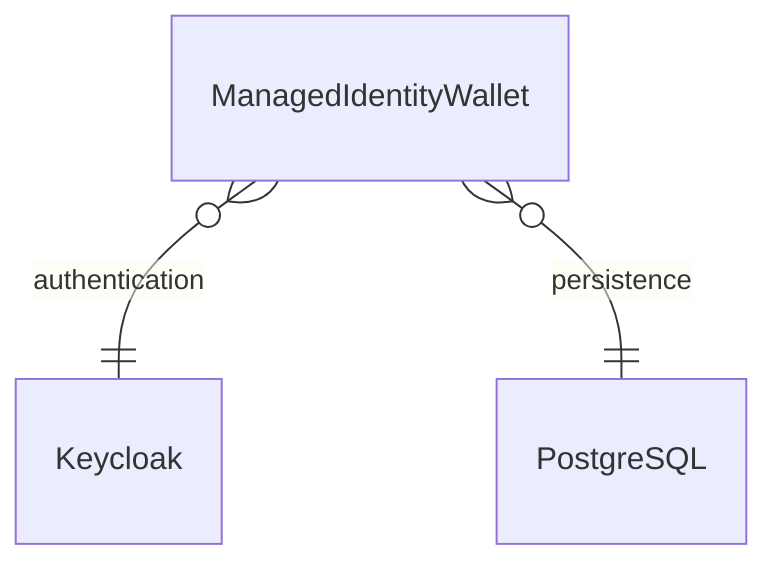

# managed-identity-wallet

  

Managed Identity Wallet is supposed to supply a secure data source and data sink for Digital Identity Documents (DID), in order to enable Self-Sovereign Identity founding on those DIDs.
And at the same it shall support an uninterrupted tracking and tracing and documenting the usage of those DIDs, e.g. within logistical supply chains.

**Homepage:** <https://github.com/eclipse-tractusx/managed-identity-wallet>

## Table of Contents

<!-- TABLE OF CONTENTS -->
<ol>
    <li><a href="#general-information">Helm Commands</a>
        <ul>
            <li><a href="#get-repo-info">Get Repository Info</a></li>
            <li><a href="#install-chart">Install Chart</a></li>
            <li><a href="#uninstall-chart">Uninstall Chart</a></li>
            <li><a href="#upgrading-chart">Upgrading Chart</a></li>
        </ul>
    </li>
    <li><a href="#requirements">Requirements</a></li>
    <li><a href="#values">Values</a></li>
    <li><a href="#deployment">Deployment</a></li>
    <li><a href="#configuration">Configuration</a></li>
</ol>

## Helm Commands

### Get Repository Info

    helm repo add tractusx-dev https://eclipse-tractusx.github.io/charts/dev
    helm repo update

    helm repo add tractusx-dev https://eclipse-tractusx.github.io/charts/stable
    helm repo update

(<a href="#readme-top">back to top</a>)

### Install Chart

    helm install [RELEASE_NAME] tractusx-dev/managed-identity-wallet

    helm install [RELEASE_NAME] tractusx-stable/managed-identity-wallet

(<a href="#readme-top">back to top</a>)

The command deploys miw on the Kubernetes cluster in the default configuration.

See configuration below.

See [helm install](https://helm.sh/docs/helm/helm_install/) for command documentation.

(<a href="#readme-top">back to top</a>)

### Uninstall Chart

    helm uninstall [RELEASE_NAME]

This removes all the Kubernetes components associated with the chart and deletes the release.

See [helm uninstall](https://helm.sh/docs/helm/helm_uninstall/) for command documentation.

(<a href="#readme-top">back to top</a>)

### Upgrading Chart

    helm upgrade [RELEASE_NAME] [CHART]

See [helm upgrade](https://helm.sh/docs/helm/helm_upgrade/) for command documentation.

(<a href="#readme-top">back to top</a>)

## Requirements

| Repository | Name | Version |
|------------|------|---------|
| https://charts.bitnami.com/bitnami | common | 2.x.x |
| https://charts.bitnami.com/bitnami | keycloak | 15.1.6 |
| https://charts.bitnami.com/bitnami | postgresql | 11.9.13 |

(<a href="#readme-top">back to top</a>)

## Values

| Key | Type | Default | Description |
|-----|------|---------|-------------|
| affinity | object | `{}` | Affinity configuration |
| envs | object | `{}` | envs Parameters for the application (will be provided as environment variables) |
| fullnameOverride | string | `""` | String to fully override common.names.fullname template |
| image.pullPolicy | string | `"Always"` | PullPolicy |
| image.repository | string | `"tractusx/managed-identity-wallet"` | Image repository |
| image.tag | string | `""` | Image tag (empty one will use "appVersion" value from chart definition) |
| ingress.annotations | object | `{}` | Ingress annotations |
| ingress.enabled | bool | `false` | Enable ingress controller resource |
| ingress.hosts | list | `[]` | Ingress accepted hostnames |
| ingress.tls | list | `[]` | Ingress TLS configuration |
| keycloak.auth.adminPassword | string | `""` | Keycloak admin password |
| keycloak.auth.adminUser | string | `"admin"` | Keycloak admin user |
| keycloak.enabled | bool | `true` | Enable to deploy Keycloak |
| keycloak.extraEnvVars[0].name | string | `"KEYCLOAK_HOSTNAME"` |  |
| keycloak.extraEnvVars[0].value | string | `"{{ .Release.Name }}-keycloak"` |  |
| keycloak.keycloakConfigCli.backoffLimit | int | `2` | Number of retries before considering a Job as failed |
| keycloak.keycloakConfigCli.enabled | bool | `true` | Enable to create the miw playground realm |
| keycloak.keycloakConfigCli.existingConfigmap | string | `"keycloak-realm-config"` | Existing configmap name for the realm configuration |
| keycloak.postgresql.auth.database | string | `"miw_keycloak"` | Database name |
| keycloak.postgresql.auth.password | string | `""` | KeycloakPostgresql password to set (if empty one is generated) |
| keycloak.postgresql.auth.username | string | `"miw_keycloak"` | Keycloak PostgreSQL user |
| keycloak.postgresql.enabled | bool | `true` | Enable to deploy PostgreSQL |
| keycloak.postgresql.nameOverride | string | `"keycloak-postgresql"` | Name of the PostgreSQL chart to deploy. Mandatory when the MIW deploys a PostgreSQL chart, too. |
| miw.authorityWallet.bpn | string | `"BPNL000000000000"` | Authority Wallet BPNL |
| miw.authorityWallet.name | string | `""` | Authority Wallet Name |
| miw.database.encryptionKey.secret | string | `""` | Existing secret for database encryption key |
| miw.database.encryptionKey.secretKey | string | `""` | Existing secret key for database encryption key |
| miw.database.encryptionKey.value | string | `""` | Database encryption key for confidential data.  Ignored if `secret` is set. If empty a secret with 32 random alphanumeric chars is generated. |
| miw.database.host | string | `"{{ .Release.Name }}-postgresql"` | Database host |
| miw.database.name | string | `"miw_app"` | Database name |
| miw.database.port | int | `5432` | Database port |
| miw.database.secret | string | `"{{ .Release.Name }}-postgresql"` | Existing secret name for the database password |
| miw.database.secretPasswordKey | string | `"password"` | Existing secret key for the database password |
| miw.database.useSSL | bool | `false` | Set to true to enable SSL connection to the database |
| miw.database.user | string | `"miw"` | Database user |
| miw.environment | string | `"dev"` | Runtime environment. Should be ether local, dev, int or prod |
| miw.host | string | `"{{ .Release.Name }}-managed-identity-wallet:8080"` | Host name |
| miw.keycloak.clientId | string | `"miw_private_client"` | Keycloak client id |
| miw.keycloak.realm | string | `"miw_test"` | Keycloak realm |
| miw.keycloak.url | string | `"http://{{ .Release.Name }}-keycloak"` | Keycloak URL |
| miw.logging.level | string | `"INFO"` | Log level. Should be ether ERROR, WARN, INFO, DEBUG, or TRACE. |
| miw.ssi.enforceHttpsInDidWebResolution | bool | `false` | Enable to use HTTPS in DID Web Resolution |
| miw.ssi.vcExpiryDate | string | `""` | Verifiable Credential expiry date. Format 'dd-MM-yyyy'. If empty it is set to 31-12-<current year> |
| nameOverride | string | `""` | String to partially override common.names.fullname template (will maintain the release name) |
| nodeSelector | object | `{"kubernetes.io/os":"linux"}` | NodeSelector configuration |
| podAnnotations | object | `{}` | PodAnnotation configuration |
| podSecurityContext | object | `{}` | PodSecurityContext |
| postgresql.auth.database | string | `"miw_app"` | Postgresql database to create |
| postgresql.auth.enablePostgresUser | bool | `false` | Enable postgresql admin user |
| postgresql.auth.password | string | `""` | Postgresql password to set (if empty one is generated) |
| postgresql.auth.username | string | `"miw"` | Postgresql user to create |
| postgresql.backup.conjob.schedule | string | `"* */6 * * *"` | Backup schedule |
| postgresql.backup.conjob.storage.existingClaim | string | `""` | Name of an existing PVC to use |
| postgresql.backup.conjob.storage.resourcePolicy | string | `"keep"` | Set resource policy to "keep" to avoid removing PVCs during a helm delete operation |
| postgresql.backup.conjob.storage.size | string | `"8Gi"` | PVC Storage Request for the backup data volume |
| postgresql.backup.enabled | bool | `false` | Enable to create a backup cronjob |
| postgresql.enabled | bool | `true` | Enable to deploy Postgresql |
| replicaCount | int | `1` | The amount of replicas to run |
| resources.limits.cpu | int | `2` | CPU resource limits |
| resources.limits.memory | string | `"1Gi"` | Memory resource limits |
| resources.requests.cpu | string | `"250m"` | CPU resource requests |
| resources.requests.memory | string | `"500Mi"` | Memory resource requests |
| secrets | object | `{}` | Parameters for the application (will be stored as secrets - so, for passwords, ...) |
| securityContext.allowPrivilegeEscalation | bool | `false` | Allow privilege escalation |
| securityContext.privileged | bool | `false` | Enable privileged container |
| securityContext.runAsGroup | int | `11111` | Group ID used to run the container |
| securityContext.runAsNonRoot | bool | `true` | Enable to run the container as a non-root user |
| securityContext.runAsUser | int | `11111` | User ID used to run the container |
| service.port | int | `8080` | Kubernetes Service port |
| service.type | string | `"ClusterIP"` | Kubernetes Service type |
| serviceAccount.annotations | object | `{}` | Annotations to add to the ServiceAccount |
| serviceAccount.create | bool | `true` | Enable creation of ServiceAccount |
| serviceAccount.name | string | `""` | The name of the ServiceAccount to use. |
| tolerations | list | `[]` | Tolerations configuration |

For more information on how to configure the Keycloak see
- https://github.com/bitnami/charts/tree/main/bitnami/keycloak.

For more information on how to configure the PostgreSQL see
- https://github.com/bitnami/charts/tree/main/bitnami/postgresql.

(<a href="#readme-top">back to top</a>)

## Deployment

The chart's default configuration includes the deployment of the Managed Identity Wallet (MIW) alongside a standalone PostgreSQL database and Keycloak. However, in production environments, it is recommended to deactivate the deployment of these additional components. The default deployment is illustrated in the diagram below.

(<a href="#readme-top">back to top</a>)

## Configuration

When deploying the MIW in a production environment please read the following sections carefully.

> **Important Disclaimer**
>
> **The default configuration is designed exclusively for development and testing purposes. It lacks the necessary security measures and is unsuitable for production environments.**
>

(<a href="#readme-top">back to top</a>)

### Secret Management

The following two secrets are required to deploy the MIW in a production environment:

- Database Password
- Database Encryption Key

The **Database Password Secret** stores the password associated with the PostgreSQL database user.

Meanwhile, the **Database Encryption Key Secret** holds the encryption key for safeguarding confidential data within the PostgreSQL database. This could include sensitive information such as private keys for wallets.

(<a href="#readme-top">back to top</a>)

### Security Considerations

Besides the database password and encryption key, the following security considerations should be taken into account
when deploying the MIW in a production environment:

1. By default, `did:web` addresses are not resolved using HTTPS, a configuration that poses security risks and requires activation.
2. Configure the Managed Identity Wallets environment to `production` for optimal settings.
3. Deploy the _Database Encryption Key Secret_ independently, avoiding reliance on auto-generated versions.
4. Enhance security by enabling TLS for the database connection.

(<a href="#readme-top">back to top</a>)

### Additional Recommendations

1. Refrain from deploying PostgreSQL and Keycloak using this chart in a production environment. It is advised to disable these deployments.
2. Determine a suitable Verifiable Credential expiry date. The current default is set to the end of each year.
3. The default Authority Wallet is designated as `BPNL000000000000`. Although using the same Authority Wallet ID as other data spaces isn't inherently insecure, it's recommended to employ a unique ID.

(<a href="#readme-top">back to top</a>)

## Maintainers

| Name | Email | Url |
| ---- | ------ | --- |
| Peter Motzko | <peter.motzko@volkswagen.de> | <https://github.com/pmoscode> |

(<a href="#readme-top">back to top</a>)

----------------------------------------------
Autogenerated from chart metadata using [helm-docs v1.11.0](https://github.com/norwoodj/helm-docs/releases/v1.11.0)
