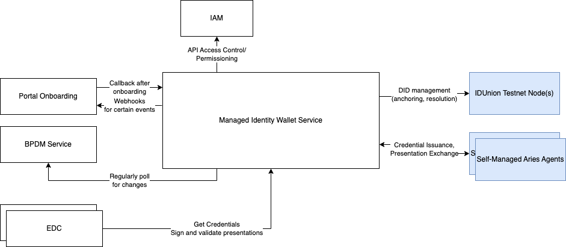
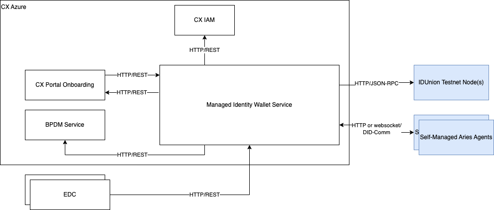
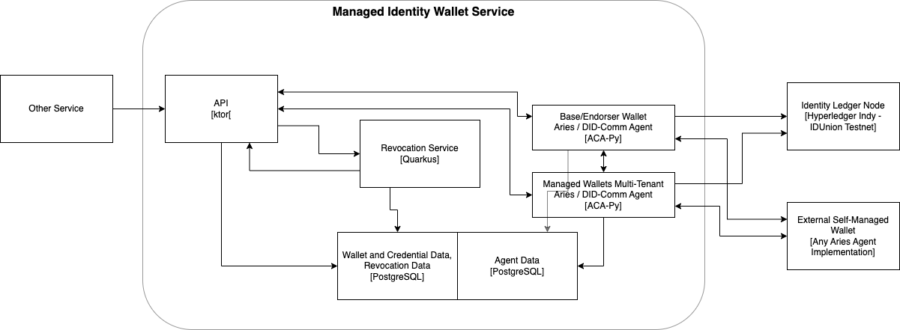
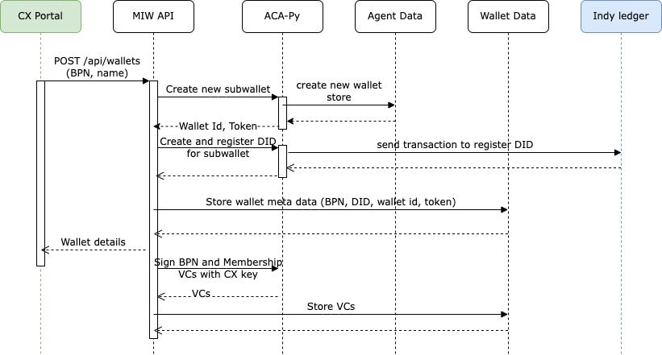
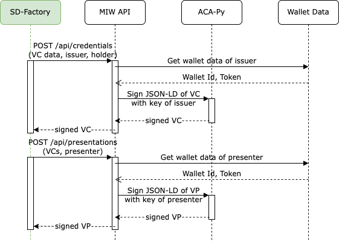
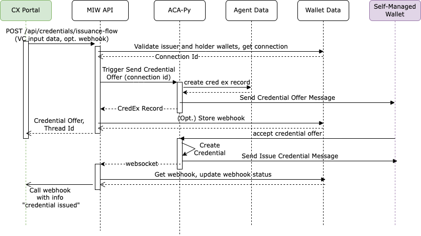
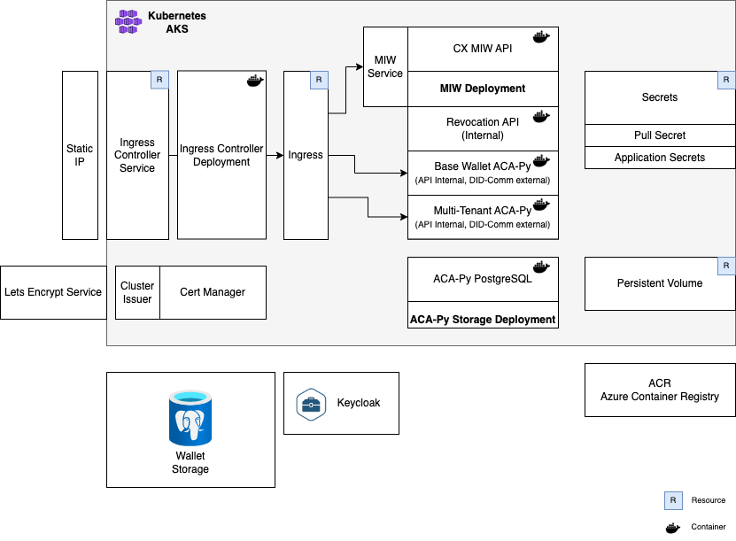

# Managed Identity Wallet ARC42 Documentation

- [Managed Identity Wallet ARC42 Documentation](#managed-identity-wallet-arc42-documentation)
- [Introduction and Goals](#introduction-and-goals)
  - [Requirements Overview](#requirements-overview)
  - [Quality Goals](#quality-goals)
  - [Stakeholders](#stakeholders)
- [Architecture Constraints](#architecture-constraints)
- [System Scope and Context](#system-scope-and-context)
  - [Business Context](#business-context)
  - [Technical Context](#technical-context)
- [Solution Strategy](#solution-strategy)
- [Building Block View](#building-block-view)
  - [Whitebox Overall System](#whitebox-overall-system)
- [Runtime View](#runtime-view)
    - [Create Managed Wallet for Legal Entity](#create-managed-wallet-for-legal-entity)
    - [Update Business Partner Data for Managed Wallet](#update-business-partner-data-for-managed-wallet)
    - [Issue Credential and Presentation for Managed Wallet](#issue-credential-and-presentation-for-managed-wallet)
    - [Register Self-Managed Wallet](#register-self-managed-wallet)
    - [Issue Credential from Catena-X Base Wallet to Self-Managed Wallet](#issue-credential-from-catena-x-base-wallet-to-self-managed-wallet)
    - [Receive Externally Issued Credential to Managed Wallet](#receive-externally-issued-credential-to-managed-wallet)
    - [Permission Handling](#permission-handling)
    - [Data Model / Schemas](#data-model--schemas)
      - [Credential Type BpnCredential](#credential-type-bpncredential)
      - [Credential Type MembershipCredential](#credential-type-membershipcredential)
      - [Credential Type NameCredential](#credential-type-namecredential)
      - [Credential Type AddressCredential](#credential-type-addresscredential)
      - [Credential Type BankAccountCredential](#credential-type-bankaccountcredential)
      - [Credential Type LegalFormCredential](#credential-type-legalformcredential)
- [Deployment View](#deployment-view)
- [Cross-cutting Concepts](#cross-cutting-concepts)
- [Design Decisions](#design-decisions)
    - [Selection of DID method](#selection-of-did-method)
    - [Usage of ACA-Py versus other framework versus own implementation](#usage-of-aca-py-versus-other-framework-versus-own-implementation)
    - [Concept and Implementation of Credential Revocation](#concept-and-implementation-of-credential-revocation)
    - [Concept and Implementation of Interaction with Self-Managed Wallets](#concept-and-implementation-of-interaction-with-self-managed-wallets)
- [Quality Requirements](#quality-requirements)
- [Risks and Technical Debts](#risks-and-technical-debts)
- [Glossary](#glossary)


Introduction and Goals
======================

To align the identity, authentication and data exchange of CX participants with the open and decentralized concepts within [GAIA-X](https://www.gxfs.eu/specifications/), especially self-sovereign identities, every legal entity associated to a BPNL number should have the possibility to also get a [W3C compliant DID](https://www.w3.org/TR/did-core/) (Decentralized Identifier). Due to the lack of production-ready SSI infrastructure and slow adoption on the market, this is in a first step achieved by providing a managed wallet (also called "Custodian") with a private/public key pair and related DID for a legal entity along with the onboarding to CX. This wallet can then be used via the Managed Identity Wallet API by other CX services or applications such as the Self Description Hub or the EDC to issue and retrieve [verifiable credentials](https://www.w3.org/TR/vc-data-model/) and create verifiable presentations on behalf of a certain legal entity as part of CX processes and use cases. In later steps, the same DID and credentials can be transferred to an external wallet managed by the legal entity itself, allowing self-sovereign data management and communication. Alternatively, a company can already "bring its own DID" upon onboarding and register it as a self-managed wallet for later interactions with CX managed wallets for credential and presentation exchange.

Requirements Overview
---------------------

The basic requirements for the Managed Identity Wallet can be summarised as follows:

*   Establish a Catena-X DID and associated wallet as trust anchor for issuing CX related verifiable credentials
*   Link each BPNL to a unique DID distinguishing two cases
    *   managed: create and register a new DID and managed wallet, and allow the owners or administrators of the BPNL to access the related wallet and credentials via a REST API
    *   self-managed: connect an existing DID and external wallet provided by the owner or administrator of the BPNL in order to issue CX related verifiable credentials to and request presentations from the related DID
*   Allow other Catena-X components as well as DID owners to issue and store verifiable credentials
*   Allow other Catena-X components as well as DID owners to create and validate verifiable credentials
*   Issue and revoke verifiable credentials for Catena-X related data such as the BPN, membership status, business partner data (addresses, bank data etc.) according to the onboarding and change processes
*   Allow (defined / allow-listed) external issuer wallets to connect to managed wallets and issue credentials for the managed wallet DID as the holder

Quality Goals
-------------

| Title of Goal | Description and Reason |
| ------------- | ---------------------- |
| Security | The Managed Identity Wallet Service must be highly secure in terms of storage and access control, since it handles sensitive private key and claim information. |
| Scalability | The Managed Identity Wallet Service must scale to the expected amount of participants without significant decrease of execution time. |
| Maintainability | The Managed Identity Wallet Service should be structured in a modular way and re-use existing (open-source) components, frameworks and libraries where possible, so it can be extended and maintained in an efficient way. |

Stakeholders
------------

The key stakeholders of the component are:

*   Catena-X Operating Company: to be compliant with Catena-X SSI concepts, especially for verifiable presentations in self descriptions
*   EDC operators: to be able to use SSI based identity and access management for the communication between data consumer and provider

Architecture Constraints
========================

The architecture of the Managed Identity Wallet Service follows the general principles, guidelines and boundaries from the Catena-X project.

System Scope and Context
========================

The Managed Identity Wallet Service is primarily used as an internal service within other Catena-X service or related components like EDC, but can also directly connect peer-to-peer with other DID agents.

Business Context
----------------



Technical Context
-----------------



Solution Strategy
=================

The Managed Identity Wallet is implemented as an independent REST API service using the following technology stack:

*   Ktor Framework (Kotlin) on JDK 17
*   PostgreSQL database
*   [ACA-Py](https://github.com/hyperledger/aries-cloudagent-python) multi-tenant Hyperledger Aries agent (third-party Docker image, Python-based implementation)
*   GXFS Notarization API Revocation service (third-party Docker image, Quarkus-based implementation)
*   Gradle build
*   Dockerized setup for Kubernetes with Helm

Building Block View
===================

Whitebox Overall System
-----------------------

The service consists of a main API implementation, connected to its own PostgreSQL database, a multi-tenancy enabled ACA-Py agent with its own PostgreSQL database, and an internal Revocation Service..



The API part is internally structured in different packages and classes for the API routes, most logic is contained in service classes abstracted by interfaces:

*   Routes:
    *   Did Document: DID resolution and management
    *   VC: issuance and revocation of verifiable credentials
    *   VP: issuance and validation of verifiable presentations
    *   Wallet: management (CRUD) of identity wallets
*   Services:
    *   AcaPyService: Abstraction of calls and response handling of ACA-Py
    *   Aries Event Handler: Processing of incoming Aries DID-Comm messages (separate listeners for Base Wallet and Multi-Tenants Wallet)
    *   Business Partner Data Service: Abstraction of calls and response handling of BPDM
    *   RevocationService: Abstraction of calls and response handling of the revocation service
    *   WalletService: General wallet management and orchestration logic
    *   WebhookService: Abstraction of external webhook handling (webhooks called by the MIW as callback)

Runtime View
============

The currently released API specification and documentation (INT environment) can be found under [https://managed-identity-wallets.int.demo.catena-x.net/docs](https://managed-identity-wallets.int.demo.catena-x.net/docs).

In general, the API covers the following functionality:

*   Create, remove and retrieve managed wallets
*   Create or update business partner data related credentials
*   Manage DID document of the DID of a managed wallet (currently supports only adding or updating service endpoints)
*   Generate and store verifiable credentials issued by a particular identifier of a managed wallet or the Catena-X platform issuer
*   Create a verifiable presentation for a given list of VCs and presenter (as identifier of a managed wallet)
*   Validate a given verifiable presentation (convenience functionality, currently only supports Indy DIDs as issuers or holders)
*   Register self-managed wallets based on an existing DID
*   Trigger and handle the issue credential Aries flow for the Catena-X wallet as the issuer

In the following, the most relevant operations are described as sequence diagrams.

_Note that for managed wallets, VCs and VPs are only generated in an ephemeral way or stored in the own data store of the API, not by using Hyperledger Aries flows and storing them in the agent data._

### Create Managed Wallet for Legal Entity



### Update Business Partner Data for Managed Wallet


  

### Issue Credential and Presentation for Managed Wallet



### Register Self-Managed Wallet


### Issue Credential from Catena-X Base Wallet to Self-Managed Wallet



### Receive Externally Issued Credential to Managed Wallet


The flow depicted in this sequence follows the Aries flows RFC 0023 "DID-Exchange Protocol 1.0" (https://github.com/hyperledger/aries-rfcs/blob/main/features/0023-did-exchange/README.md) with implicit invitation by public DID for the connection establishment, and RFC 0453 "Issue Credential Protocol 2.0" (https://github.com/hyperledger/aries-rfcs/tree/main/features/0453-issue-credential-v2) for the credential issuance.

### Permission Handling

For the API access, technical users are authenticated based on bearer tokens (JWT) issued by the Catena-X Keycloak. Each API operation specifies, which scopes/roles are required in order to be allowed to execute this operations, additionally the BPN associated to a user (available as a claim in the JWT) is considered to restrict access to the DID or wallet of the legal entity the user belongs to.

For details on the permissions see the README section on scopes ([https://github.com/eclipse-tractusx/managed-identity-wallets#scopes-](https://github.com/eclipse-tractusx/managed-identity-wallets#scopes-)) as well as the statements about permissions in the API doc ([https://managed-identity-wallets.int.demo.catena-x.net/docs](https://managed-identity-wallets.int.demo.catena-x.net/docs)).

### Data Model / Schemas

The Managed Identity Wallet service issues a couple of verifiable credentials with the DID of the Catena-X platform issuer related to Catena-X membership and business partner data. For the credential types and data model of those verifiable credentials, an own JSON-LD context was defined in a separate GitHub repository https://github.com/catenax-ng/product-core-schemas and referenced as raw content in the verifiable credentials context https://raw.githubusercontent.com/catenax-ng/product-core-schemas/main/legalEntity. The schema defines the following credential types, each with a brief description and example.

#### Credential Type BpnCredential

Attestation of the BPNL to a particular DID

```
"credentialSubject": {
                "type": [
                    "BpnCredential"
                ],
                "bpn": "BPNL00000000XS2X",
                "id": "did:sov:7rB93fLvW5kgujZ4E57ZxL"
            }
```

#### Credential Type MembershipCredential

Attestation of Catena-X membership

```
"credentialSubject": {
                "type": [
                    "MembershipCredential"
                ],
                "memberOf": "Catena-X",
                "status": "Active",
                "startTime": "2022-11-29T10:37:50Z",
                "id": "did:sov:7rB93fLvW5kgujZ4E57ZxL"
            }
```

#### Credential Type NameCredential

Credential representation of a BPDM name element

```
"credentialSubject": {
                "data": {
                    "value": "Scharr-Tec GmbH & Co KG",
                    "nameType": {
                        "technicalKey": "LOCAL",
                        "name": "The business partner name identifies a business partner in a given context, e.g. a country or region.",
                        "url": ""
                    },
                    "language": {
                        "technicalKey": "undefined",
                        "name": "Undefined"
                    }
                },
                "type": [
                    "NameCredential"
                ],
                "id": "did:sov:7rB93fLvW5kgujZ4E57ZxL"
            }
```

#### Credential Type AddressCredential

Credential representation of a BPDM legal address element

```
"credentialSubject": {
                "data": {
                    "version": {
                        "characterSet": {
                            "technicalKey": "LATIN",
                            "name": "Latin"
                        },
                        "language": {
                            "technicalKey": "en",
                            "name": "English"
                        }
                    },
                    "contexts": [],
                    "country": {
                        "technicalKey": "DE",
                        "name": "Germany"
                    },
                    "administrativeAreas": [],
                    "postCodes": [
                        {
                            "value": "70565",
                            "postCodeType": {
                                "technicalKey": "OTHER",
                                "name": "Other type",
                                "url": ""
                            }
                        }
                    ],
                    "localities": [
                        {
                            "value": "Stuttgart",
                            "localityType": {
                                "technicalKey": "OTHER",
                                "name": "Other",
                                "url": ""
                            },
                            "language": {
                                "technicalKey": "en",
                                "name": "English"
                            }
                        }
                    ],
                    "thoroughfares": [
                        {
                            "value": "Liebknechtstr.",
                            "number": "50",
                            "thoroughfareType": {
                                "technicalKey": "OTHER",
                                "name": "Other type",
                                "url": ""
                            },
                            "language": {
                                "technicalKey": "en",
                                "name": "English"
                            }
                        }
                    ],
                    "premises": [],
                    "postalDeliveryPoints": [],
                    "types": []
                },
                "type": [
                    "AddressCredential"
                ],
                "id": "did:sov:7rB93fLvW5kgujZ4E57ZxL"
            }
```

#### Credential Type BankAccountCredential

Credential representation of a BPDM bank account element

```
"credentialSubject": {
    "data": {
        "internationalBankAccountIdentifier": "DE52500105172967846858",
        "internationalBankIdentifier": "INGDDEFFXXX",
        "currency": {
            "technicalKey": "EUR",
            "name": "Euro"
        }
    },
    "type": [
        "BankAccountCredential"
    ],
    "id": "did:sov:7rB93fLvW5kgujZ4E57ZxL"
}
````

#### Credential Type LegalFormCredential

Credential representation of the BPDM legal form information

```
"credentialSubject": {
    "data": {
        "technicalKey": "DE_AG",
        "name": "Aktiengesellschaft",
        "mainAbbreviation": "AG",
        "language": {
            "technicalKey": "de",
            "name": "German"
        },
        "categories": [{
            "name": "AG",
            "url": ""
        }]
    },
    "type": [
        "LegalFormCredential"
    ],
    "id": "did:sov:7rB93fLvW5kgujZ4E57ZxL"
}
```

Deployment View
===============

A description of the overall structure of components including how to run and test it locally as well as on Kubernetes in the cloud is available in the GitHub repository: [https://github.com/eclipse-tractusx/managed-identity-wallets](https://github.com/eclipse-tractusx/managed-identity-wallets)

The following diagram provides an overview of the deployment structure in Kubernetes (AKS).



  

Cross-cutting Concepts
======================

The main driver behind the Managed Identity Wallet Service was the compliance and compatibility with W3C SSI standards als in relation to GAIA-X principles. The solution is based on and uses a couple of standards or re-usable open-source components that can considered of overarching concern:

*   W3C Decentralized Identifiers (DIDs) [https://www.w3.org/TR/did-core/](https://www.w3.org/TR/did-core/)
*   W3C Verifiable Credential Data Model [https://www.w3.org/TR/vc-data-model/](https://www.w3.org/TR/vc-data-model/)
*   W3C Status List 2021 [https://w3c-ccg.github.io/vc-status-list-2021/](https://w3c-ccg.github.io/vc-status-list-2021/)
*   Linux Foundation Hyperledger Aries ([https://github.com/hyperledger/aries](https://github.com/hyperledger/aries)) incorporating the DIF DIDComm messaging standard ([https://identity.foundation/didcomm-messaging/spec/](https://identity.foundation/didcomm-messaging/spec/))
*   Hyperledger Aries Cloud Agent Python (ACA-Py, [https://github.com/hyperledger/aries-cloudagent-python](https://github.com/hyperledger/aries-cloudagent-python))
*   GAIA-X Federated Services (GXFS) Notarization API Revocation Service reference implementation ([https://gitlab.com/gaia-x/data-infrastructure-federation-services/not/notarization-service/-/tree/main/services/revocation](https://gitlab.com/gaia-x/data-infrastructure-federation-services/not/notarization-service/-/tree/main/services/revocation))

Design Decisions
================

Decisions were made on several aspects as part of the sprint work in further development of the Managed Identity Wallet Service.

### Selection of DID method

Summary: decision was towards Indy DID (did:sov and future did:indy) due to the compatibility to the IDUnion network and most available Aries agent implementations such as the [Business Partner Agent](https://github.com/hyperledger-labs/business-partner-agent). In general, the solution should be open to support other DID methods for resolution and as the holder or presenter of credentials in the future.

### Usage of ACA-Py versus other framework versus own implementation

Summary: The evaluation revealed that ACA-Py can be used with certain limitations since it meets the basic requirements. We decided to use it to save implementation time, and address the limitations within the ACA-Py community, possibly by contributing extensions or fixes in the future.

### Concept and Implementation of Credential Revocation

Summary: Given the standardisation activities in W3C and the already available implementation from the GXFS Notarization Service, the recommendation is to use the Status List 2021 approach. For the implementation, the revocation service in the GXFS Notarization Service should be re-used if possible, ideally without any source code dependencies using the published Docker image ([https://gitlab.com/gaia-x/data-infrastructure-federation-services/not/notarization-service/container\_registry/3120998](https://gitlab.com/gaia-x/data-infrastructure-federation-services/not/notarization-service/container_registry/3120998)).

### Concept and Implementation of Interaction with Self-Managed Wallets

Summary: Since Hyperledger Aries based on DID-Comm seems to evolve into an industry standard for VC and VP interoperability (e.g. also in GAIA-X specifications) and there are already working implementations (most known ACA-Py that we also use in the MIW), it is the preferred option.

Quality Requirements
====================

The Managed Identity Wallet sticks to the Quality Gate requirements of the overall Catena-X project where relevant:

*   Documentation: Architecture
*   Documentation: Administrator's Guide
*   Documentation: Interfaces
*   Documentation: Source Code
*   Documentation: Development Process
*   Documentation: Standardization - Interoperability and Data Sovereignty
*   Compliance: GDPR
*   Test Results: Deployment/Installation
*   Test Results: Code Quality Analysis
*   Test Results: System Integration Tests
*   Security & Compliance: Penetration Tests
*   Security & Compliance: Threat Modeling
*   Security & Compliance: Static Application Security Testing
*   Security & Compliance: Dynamic Application Security Testing
*   Security & Compliance: Secret scanning
*   Security & Compliance: Software Composition Analysis
*   Security & Compliance: Container Scan
*   Security & Compliance: Infrastructure as Code

Risks and Technical Debts
=========================

| Topic | Description and Explanation | Recommendation |
| ----- | --------------------------- | -------------- |
| Indy DID: Lacking support in Indy SDK and thus ACA-Py, needed to use did:sov for now | The W3C compliant DID method specification for Indy ([https://hyperledger.github.io/indy-did-method/](https://hyperledger.github.io/indy-did-method/)) is still fairly new and not yet fully implemented in major clients. That is why we had to use the Sovrin DID ([https://sovrin-foundation.github.io/sovrin/spec/did-method-spec-template.html](https://sovrin-foundation.github.io/sovrin/spec/did-method-spec-template.html)) for now, which is not fully W3C compliant and does not contain a network identifier to distinguish different ledgers (e.g. testnet and mainnet) in the DID. | The implementation should be adjusted to did:indy as soon as ACA-Py releases support for this. |
| Availability of mainnet | I it envisioned to use the IDUnion mainnet as the Indy ledger for a productive solution. This mainnet is still under construction and not yet available for public use, there is also no committed target date, expectations are towards end of 2022, which would be sufficient for the timeline of Catena-X. | Escalate to IDUnion contacts when it becomes clear that the expected date of general availability can not be met. |
| Performance | In tests especially with the EDC, response times of the Managed Wallet Service were rather poor, taking several seconds for operations like create wallet, credential issuance, creation or validation of presentations. | Slow response times need to be analysed and optimised, special load and performance tests should be conducted for the most relevant use cases and scenarios. |
| Lack of development resources and budget: open issues from implementation of integration with self-managed wallets | <ul><li>Interaction with a self-managed wallet must still be configured and tested in the cloud setup</li><li>Request presentation from self-managed wallets is not implemented</li><li>Issued verifiable credentials to self-managed wallets do not support revocation yet</li><li>The interaction is only possible with the Catena-X wallet (currently, there is no requirement to do that for other wallets, though)</li></ul> |

  

Glossary
========

| Term | Description |
| ---- | ----------- |
| Gaia-X | Gaia-X represents the next generation of data infrastructure ecosystem: an open, transparent, and secure digital ecosystem, where data and services can be made available, collated and shared in an environment of trust. ([more](https://gaia-x.eu/what-is-gaia-x/about-gaia-x/))
| Catena-X Portal / Onboarding Process | The portal is used for the registration/onboarding process in Catena-X and includes the login, user management and the initial registration.
| Decentralized Identifier (DID) | Decentralized Identifiers are a new type of identifiers that enables verifiable, decentralized digital identity. ([more](https://www.w3.org/TR/did-core/))
| Claim, Verifiable Credential | An assertion made about a subject by an issuer. ([more](https://www.w3.org/TR/vc-data-model/))
| Holder, Subject | Is the user that holds the verifiable credentials, usually the subject. ([more](https://www.w3.org/TR/vc-data-model/))
| Issuer | Is an instance that can issue verifiable credentials. ([more](https://www.w3.org/TR/vc-data-model/))
| Verifiable Presentation | The expression of a subset of one's persona is called a verifiable presentation. ([more](https://www.w3.org/TR/vc-data-model/))
| Verifier | Is an instance that verifies the verifiable credentials of the holder. ([more](https://www.w3.org/TR/vc-data-model/))
| Credential revocation | Is the process that an issuers marks a previously issued, valid, and non-expired credential as revoked and no longer valid
| DIDComm / DID-Comm | Is a messaging format to securely communicate between DIDs, typically using agents. ([more](https://identity.foundation/didcomm-messaging/spec/))
| Hyperledger Aries | Is a set of standard protocols (=workflows and message formats) and tools to allow meaningful interactions between DIDs, adding semantics to the basic DIDComm messaging ([more](https://github.com/hyperledger/aries))
| Managed vs. Self-Managed (Identity) Wallet | An identity wallet holds the private key and credentials related to one particular DID. A managed wallet means that the wallet is operated by someone else than the owner of the DID and made accessible via an additional management interface such as the Managed Identity Wallet Service. A self-managed wallet means the owner of the DID has direct control on the wallet, ideally also hosting and operating it on own premises.

  

* * *