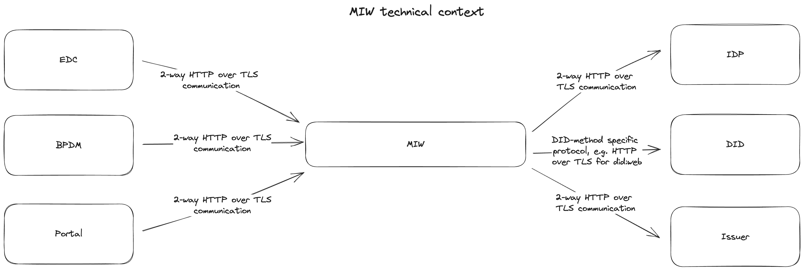
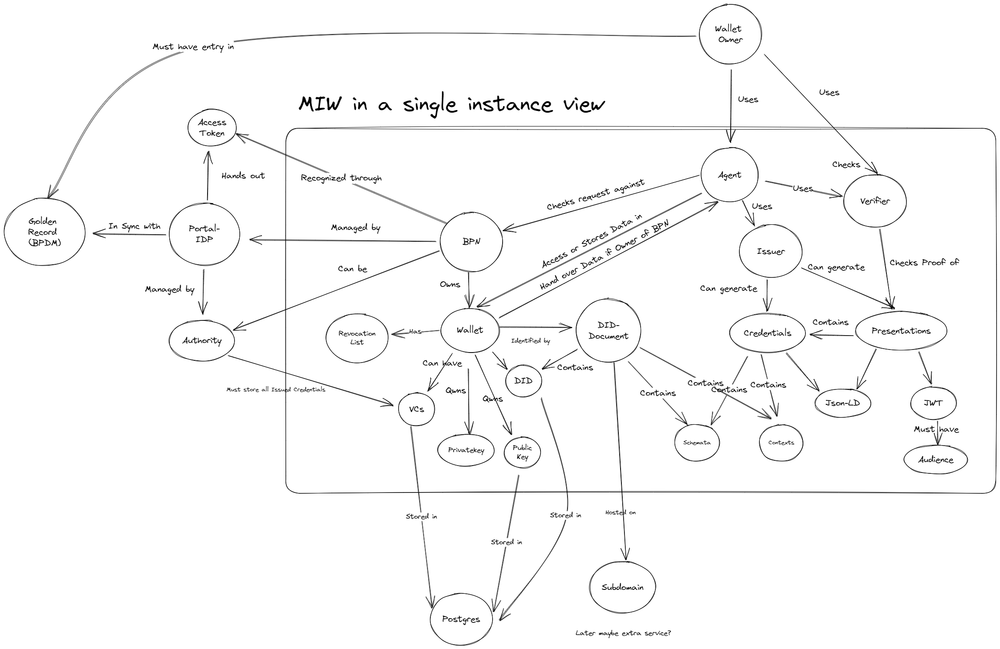
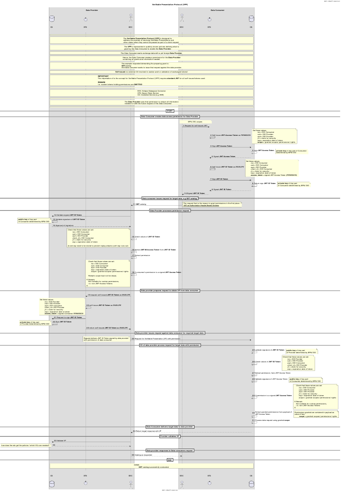

# Table of content

[[toc]]

# Introduction and Goals

To align the identity, authentication and data exchange of participants with
the open and decentralized concepts within
[GAIA-X](https://www.gxfs.eu/specifications/), especially self-sovereign
identities, every legal entity associated to a Business Partner Network (BPN)
number should have the possibility to also get a [W3C compliant Decentralized
Identifier](https://www.w3.org/TR/did-core/) (DID). Due to the lack of
production-ready SSI infrastructure and slow adoption on the market, this is in
a first step achieved by providing a managed wallet with a private/public key
pair and related DID for a legal entity along with the onboarding. This wallet
can then be used via the Managed Identity Wallet API by other services or
applications such as the Self Description Hub or the Eclipse Dataspace
Connectro (EDC) to issue and retrieve [Verifiable
Credentials](https://www.w3.org/TR/vc-data-model/) and create Verifiable
Presentations on behalf of a certain legal entity as part of governance
processes and use cases. In later steps, the same DID and credentials can be
transferred to an external wallet managed by the legal entity itself, allowing
self-sovereign data management and communication. A company can already bring
its own DID upon onboarding and register it as a self-managed wallet for later
interactions with managed wallets for credential and presentation exchange.

## Requirements Overview

The basic requirements for the Managed Identity Wallet are as follows:

- Establish a base DID and associated base wallet as trust anchor for issuing
  operator related Verifiable Credentials

- Link each BPN to a unique DID distinguishing two cases

    - managed: create and register a new DID and managed wallet, and allow the
      owners or administrators of the BPN to access the related wallet and
      credentials via a REST API

    - self-managed: connect an existing DID and external wallet provided by the
      owner or administrator of the BPN in order to issue verifiable
      credentials to and request presentations from the related DID (not in
      scope)

- Allow other service or user interface components as well as DID owners
  themselves to issue and store Verifiable Credentials

- Allow other service or user interface components as well as DID owners
  themselves to create and validate Verifiable Credentials

- Issue and revoke Verifiable Credentials for consortium related data such as
  the BPN, membership status, business partner data (addresses, bank data etc.)
  according to the onboarding and change processes

- Allow (defined / allow-listed) external issuer wallets to connect to managed
  wallets and issue credentials for the managed wallet DID as the holder

## Quality Goals

   | **Title of Goal** | **Description and Reason**                                                                                                                                                                                                 |
   |-------------------|----------------------------------------------------------------------------------------------------------------------------------------------------------------------------------------------------------------------------|
   | Security          | The Managed Identity Wallet Service must be highly secure in terms of storage and access control, since it handles sensitive private key and claim information.                                                            |
   | Scalability       | The Managed Identity Wallet Service must scale to the expected amount of participants without significant decrease of execution time.                                                                                      |
   | Maintainability   | The Managed Identity Wallet Service should be structured in a modular way and re-use existing (open-source) components, frameworks and libraries where possible, so it can be extended and maintained in an efficient way. |

## Stakeholders

The key stakeholders of the component are:

- Operating Company: to be compliant with SSI concepts, especially for
  Verifiable Presentations in GAIA-X compliant self descriptions

- EDC operators: to be able to use SSI based identity and access management for
  the communication between data consumer and provider

# Architecture Constraints

The architecture of the Managed Identity Wallet Service follows the general
principles, guidelines and boundaries from the [Tractus-X
project](https://projects.eclipse.org/projects/automotive.tractusx). You can
find more details and documentation on the [Tractus-X GitHub
page](https://github.com/eclipse-tractusx).

# System Scope and Context

The Managed Identity Wallet Service is used as a backend service for service
composition or related components like EDC, but can also connect peer-to-peer
with other DID agents.

## Business Context


## Technical Context



# Solution Strategy

The Managed Identity Wallet is implemented as an independent REST API
service using the following technology stack:

- Java 17 as a base programming language
- SpringBoot as an encompassing framework
- PostgreSQL as a database backend
- Gradle as a build tool
- Hashicorp Vault for secrets management
- Dockerized setup for Kubernetes with Helm

# Building Block View

## Big Picture View

This diagram is a zoomed out view of the MIW and the components it interacts
with.



## Overall System

The service consists of a main API implementation using SpringBoot and a
PostgreSQL database for persistance.

The Java code is organized by responsibilities, e.g. routers, services,
repositories, etc.

# Runtime View

The currently released API specification and documentation (INT environment)
can be found under
<https://managed-identity-wallets-new.int.demo.catena-x.net/>.

In general, the API covers the following functionality:

- Create, delete and read managed wallets
- Create and update business partner data related credentials
- Manage DID document of the DID of a managed wallet (currently supports only
  creating and updating service endpoints)
- Generate and persist Verifiable Credentials issued by a particular identifier
  of a managed wallet or the base wallet
- Create a Verifiable Presentation for a given list of VCs and presenter (as
  identifier of a managed wallet)
- Validate Verifiable Presentations (convenience functionality, currently only
  supports Indy DIDs as issuers or holders)
- Register self-managed wallets based on an existing DID

In the following, the most relevant operations are described as sequence
diagrams.

### Create Wallet

```plantuml
title Create Wallet

actor User as user

participant PortalIDP as keycloak
participant ManagedIdentityWallet as MIW

box "Get Accesstoken"
  user -> keycloak: Get AccessToken
  keycloak --> user: AccessToken
end box

group "Create Wallet"
    box "Create Wallet"
        user -> MIW: "/api/wallet" with BPN and Name
        group "Wallet Creation"  
            MIW -> MIW: Create Database entry
            MIW -> MIW: Create Private and Public Key
            MIW -> MIW: Store Private Key AES encrypted in DB
            MIW -> MIW: Create DID:web Document
            MIW -> MIW: Store DID-Document
        end group
        group "BPN Credential" 
            MIW -> MIW: Create BPN Credential
            MIW -> MIW: Sign JSON-LD BPN Credential with issuer private key (Private Key of Issuer Wallet)
            MIW -> MIW: Store BPN Credential
        end group
        group "Summary Credential" 
            MIW -> MIW: Access User Wallet
            MIW -> MIW: Check if Summary Credential is already Created
            MIW -> MIW: Check BPN Credential is not already in Summary Credential
            MIW -> MIW: Create Summary Credential with BPN
            MIW -> MIW: Store Summary Credential in Issuer Wallet
            MIW -> MIW: Store Summary Credential in Holder Wallet
        end group
        MIW --> user: Return Wallet
    end box
end group
```

### Issue Membership Credential

```plantuml
title Issue Membership Credential

actor User as User

participant PortalIDP as keycloak
participant ManagedIdentityWallet as MIW

box "Get Accesstoken"
  User -> keycloak: Get AccessToken
  keycloak --> User: AccessToken
end box

group "Issue Membership"
    User -> MIW: "/api/credentials/issuer/membership" with BPN
    group "Create Membership Credential" 
        MIW -> MIW: Create Use Case Credential
        MIW -> MIW: Sign JSON-LD Use Case Credential with issuer private key (Private Key of Issuer Wallet)
        MIW -> MIW: Store Credential in Issuer Wallet
        MIW -> MIW: Store Credential in Holder Wallet
    end group
    group "Summary Credential" 
        MIW -> MIW: Access User Wallet
        MIW -> MIW: Check if Summary Credential is already Created
        MIW -> MIW: Check Membership Credential is not already in Summary Credential
        MIW -> MIW: Delete Summary Credential in User Wallet
        MIW -> MIW: Create Summary Credential with specific Use Case
        MIW -> MIW: Store Summary Credential in Issuer Wallet
        MIW -> MIW: Store Summary Credential in Holder Wallet
    end group
    MIW --> User: Return signed Membership Credential
end group
```

### Issue Usecase Credential

```plantuml
title Issue UseCaseFrameworkCredential

actor User as User

participant PortalIDP as keycloak
participant ManagedIdentityWallet as MIW

box "Get Accesstoken"
  User -> keycloak: Get AccessToken
  keycloak --> User: AccessToken
end box

group "Issue UseCaseCredential"
    User -> MIW: "/api/credentials/issuer/framework" with (BPN, Type, ContractVersion, ContractTemplate)
    group "Use Case Credential" 
        MIW -> MIW: Create Use Case Credential
        MIW -> MIW: Sign JSON-LD Use Case Credential with issuer private key (Private Key of Issuer Wallet)
        MIW -> MIW: Store Credential in Issuer Wallet
    end group
    group "Summary Credential" 
        MIW -> MIW: Access User Wallet
        MIW -> MIW: Check if Summary Credential is already Created
        MIW -> MIW: Check Use Case Credential is not already in Summary Credential
        MIW -> MIW: If not delete Summary Credential in User Wallet
        MIW -> MIW: Create Summary Credential with specific Use Case
        MIW -> MIW: Store Summary Credential in Issuer Wallet
        MIW -> MIW: Store Summary Credential in Holder Wallet
    end group
    MIW --> User: Return signed Use Case Credential
end group
```

### Issue Dismantler Credential

```plantuml
title Issue Dismantler Credential

actor User as User

participant PortalIDP as keycloak
participant ManagedIdentityWallet as MIW

box "Get Accesstoken"
  User -> keycloak: Get AccessToken
  keycloak --> User: AccessToken
end box

group "Issue Dismantler Credential"
    User -> MIW: "/api/credentials/issuer/dismantler" with bpn, activityType, allowedVehicleBrands
    group "Create Dismantler Credential" 
        MIW -> MIW: Create Dismantler Credential
        MIW -> MIW: Sign JSON-LD Dismantler Credential with issuer private key (Private Key of Issuer Wallet)
        MIW -> MIW: Store Credential in Issuer Wallet
        MIW -> MIW: Store Credential in Holder Wallet
    end group
    group "Summary Credential" 
        MIW -> MIW: Access User Wallet
        MIW -> MIW: Check if Summary Credential is already Created
        MIW -> MIW: Check Dismantler Credential is not already in Summary Credential
        MIW -> MIW: Delete Summary Credential in User Wallet
        MIW -> MIW: Create Summary Credential with Dismantler added
        MIW -> MIW: Store Summary Credential in Issuer Wallet
        MIW -> MIW: Store Summary Credential in Holder Wallet
    end group
    MIW --> User: Return signed Dismantler Credential
end group
```

### Fetch Summary Verifiable Presentation 

```plantuml
title Fetch SummaryVP

actor User as User

participant PortalIDP as keycloak
participant ManagedIdentityWallet as MIW

box "Get Accesstoken"
  User -> keycloak: Get AccessToken
  keycloak --> User: AccessToken
end box

group "Get Summary VP"
    group "Get Summary Credential" 
        User -> MIW: "/api/credentials?type=['SummaryCredential']"
        MIW -> MIW: Lookup Credential in Wallet with Type
        MIW --> User: Return Credential(s) with Type
    end group
    group "Create Summary Presentation" 
        User -> MIW: "/api/presentations?withAudience=['Audience1','Audience2']+asJwt=true"
        MIW -> MIW: Issue VP with Audience as JWT
        MIW --> User: Return signed Presentation
    end group
end group
```

### Validate Verifiable Presentation

```plantuml
title Issue Membership Credential

actor User as User

participant PortalIDP as keycloak
participant ManagedIdentityWallet as MIW

box "Get Accesstoken"
  User -> keycloak: Get AccessToken
  keycloak --> User: AccessToken
end box

group "Verify/Validate Verifiable Presentation"
    User -> MIW: "/api/presentations/validation?withDateValidation=true" with VP
    group "Presentation Validation" 
        MIW -> MIW: Validate Presentation JsonLD
        MIW -> MIW: Verify Presentation Signature
    end group
    group "Credential Validation"
        MIW -> MIW: Extract VCs
        MIW -> MIW: Check Credential is not expired
        MIW -> MIW: Validate Credential JsonLD
        MIW -> MIW: Verify Credential Signature
    end group
    MIW --> User: Return Valid or Invalid + Reason
end group
```

### Permission Handling

An IAM external service, such as Keycloak, authenticates users based on a JWT
bearer token. Each API operation requires specific scopes/roles to execute the
requested operation. Additionally the BPN associated with a user (expected as a
claim in the JWT) is considered when restricting access. The following scopes
are defined:

- `view_wallets`
- `add_wallets`
- `update_wallets`
- `delete_wallets`
- `view_wallet`
- `add_wallet`
- `update_wallet`

#### Example

A decoded JWT access token might look like this:

```json
# header
{
    "alg": "HS256",
    "typ": "JWT"
}
# body
{
    "sub": "1234",
    "name": "Max Musterman",
    "iat": 1516239022,
    "scope": "view_wallets view_wallet",
    "bpn": "BPN00000000XS2X"
}
# signature
{
    ...
}
```
This token would authorize the holder to get a list of wallets or view the
wallet belonging to the BPN.

### Data Model / Schemas

The Managed Identity Wallet service issues a couple of Verifiable Credentials
with the DID of the base wallet as issuer related to membership and business
partner data. The GitHub repository
<https://github.com/catenax-ng/product-core-schemas> defines a custom JSON-LD
schema for those credential types and data model. The Verifiable Credentials
reference the raw content of the context in
<https://raw.githubusercontent.com/catenax-ng/product-core-schemas/main/legalEntity>.
The schema defines the following credential types:

**Note**: all examples highlight the important parts in <b style="color:
yellow">yellow</b>. The value types are enclosed in brackets for brevity. Some
examples:

- `[bpn]` represents a BPN number such as `"BPN00000000XS2X"`
- `[did]` represents a DID, e.g. `"did:example:123"`
- `[iso8601-timestamp]` is an ISO8601 formatted timestamp, e.g. `"2023-02-28T10:21:31Z"`
- `[uuid]` is a UUIDv4 type of UUID, e.g. `f01d7219-d1aa-48c6-beaa-9e433e80ac79`
- `[IRI]` is a URL-type of ID, but with extended characters, e.g. `"https://example.com/credentials/123"

#### BPN Credential

<pre lang="json">
{
    "@context": [
        "https://www.w3.org/2018/credentials/v1",
        "https://w3id.org/security/suites/jws-2020/v1",
        "https://raw.githubusercontent.com/catenax-ng/product-core-schemas/main/businessPartnerData"
    ],
    "id": "[uuid]",
    "type": [
        "VerifiableCredential",
        <b style="color: yellow">"BpnCredential"</b>
    ],
    "issuer": "[did]",
    "issuanceDate": "[iso8601-timestamp]",
    "credentialSubject": {
        "id": "[did]"
        "type": "BpnCredential",
        <b style="color: yellow">"bpn": "[bpn]"</b>
    }
}
</pre>

#### Behavior Twin Use Case Credential

<pre lang="json">
{
    "@context": [
        "https://www.w3.org/2018/credentials/v1",
        "https://w3id.org/security/suites/jws-2020/v1",
        "https://raw.githubusercontent.com/catenax-ng/product-core-schemas/main/UseCaseVC"
    ],
    "id": "[IRI]",
    "issuer": "[did]",
    "type": [
        "VerifiableCredential",
        <b style="color: yellow">"UseCaseFrameworkCondition"</b>
    ],
    "issuanceDate": "[iso8601-timestamp]",
    "expirationDate": "[iso8601-timestamp]",
    "credentialSubject": {
        "id": "[did]",
        <b style="color: yellow">"holderIdentifier": "[bpn]"</b>,
        "usecase-agreement": {
            <b style="color: yellow">"value": "Behavior Twin",
            "type": "cx-behavior-twin"</b>,
            "contract-template": "https://public.catena-x.org/contracts/behavior_twin.v1.pdf",
            "contract-version": "1.0.0"
        }
    },
    "proof": {
        "type": "JsonWebSignature2020",
        "created": "[iso8601-timestamp]",
        "jws": "[jws]",
        "proofPurpose": "assertionMethod",
        "verificationMethod": "[did#key-id]"
    }
}
</pre>

#### Membership Credential

Attestation of membership, currently used for Catena-X membership

<pre lang="json">
{
    "@context": [
        "https://www.w3.org/2018/credentials/v1",
        "https://w3id.org/security/suites/jws-2020/v1",
        "https://raw.githubusercontent.com/catenax-ng/product-core-schemas/main/businessPartnerData"
    ],
    "id": "[uuid]",
    "type": [
        "VerifiableCredential",
        <b style="color: yellow">"MembershipCredential"</b>
    ],
    "issuanceDate": "[iso8601-timestamp]",
    "expirationDate": "[iso8601-timestamp]",
    "issuer": "[did]",
    "credentialSubject": {
        "id": "[did]"
        <b style="color: yellow">"type": "MembershipCredential"</b>,
        <b style="color: yellow">"holderIdentifier": "[bpn]"</b>,
        <b style="color: yellow">"memberOf": "Catena-X"</b>,
        "status": "Active",
        "startTime": "[iso8601-timestamp]",
    }
}
</pre>

#### Dismantler Credential

<pre lang="json">
{
    "@context": [
        "https://www.w3.org/2018/credentials/v1",
        "https://w3id.org/security/suites/jws-2020/v1",
        "https://raw.githubusercontent.com/catenax-ng/product-core-schemas/main/businessPartnerData"
    ],
    "id": "[uuid]",
    "issuer": "[did]",
    "type": [
        "VerifiableCredential",
        <b style="color: yellow">"DismantlerCredential"</b>
    ],
    "issuanceDate": "[iso8601-timestamp]",
    "expirationDate": "[iso8601-timestamp]",
    "credentialSubject": {
        "id": "[did]",
        <b style="color: yellow">"holderIdentifier": "[bpn]",
        "allowedVehicleBrands": [
            "[brand 1]",
            "[brand 2]",
            "[brand 3]"
        ]</b>
    },
    "proof": {
        "type": "JsonWebSignature2020",
        "created": "[iso8601-timestamp]",
        "jws": "[jws]",
        "proofPurpose": "assertionMethod",
        "verificationMethod": "[did#key-id]"
    }
}
</pre>

#### PCF Use Case Credential

<pre lang="json">
{
    "@context": [
        "https://www.w3.org/2018/credentials/v1",
        "https://www.w3.org/2018/credentials/examples/v1",
        "https://raw.githubusercontent.com/catenax-ng/product-core-schemas/main/UseCaseVC"
    ],
    "id": "[uuid]",
    "issuer": "[did]",
    "type": [
        "VerifiableCredential",
        <b style="color: yellow">"UseCaseFrameworkCondition"</b>
    ],
    "issuanceDate": "[iso8601-timestamp]",
    "expirationDate": "[iso8601-timestamp]", //Optional field
    "credentialSubject": {
        "id": "[did]",
        <b style="color: yellow">"holderIdentifier": "[bpn]"</b>,
        "usecaseAgreement": {
            <b style="color: yellow">"value": "PCF",
            "type": "cx-pcf"</b>,
            "contract-template": "https://public.catena-x.org/contracts/pcf.v1.pdf",
            "contract-version": "1.0.0"
        }
    },
    "proof": {
        "type": "JsonWebSignature2020",
        "created": "[iso8601-timestamp]",
        "jws": "[jws]",
        "proofPurpose": "assertionMethod",
        "verificationMethod": "[did#key-id]"
    }
}
</pre>

#### Quality Use Case Credential

<pre lang="json">
{
    "@context": [
        "https://www.w3.org/2018/credentials/v1",
        "https://w3id.org/security/suites/jws-2020/v1",
        "https://raw.githubusercontent.com/catenax-ng/product-core-schemas/main/UseCaseVC"
    ],
    "id": "[uuid]",
    "issuer": "[did]",
    "type": [
        "VerifiableCredential",
        <b style="color: yellow">"UseCaseFrameworkCondition"</b>
    ],
    "issuanceDate": "[iso8601-timestamp]",
    "expirationDate": "[iso8601-timestamp]",
    "credentialSubject": {
        "id": "[did]",
        <b style="color: yellow">"holderIdentifier": "[bpn]"</b>,
        "usecase-agreement": {
            <b style="color: yellow">"value": "Quality",
            "type": "cx-quality"</b>,
            "contract-template": "https://public.catena-x.org/contracts/quality.v1.pdf",
            "contract-version": "1.0.0"
        }
    },
    "proof": {
        "type": "JsonWebSignature2020",
        "created": "[iso8601-timestamp]",
        "jws": "[jws]",
        "proofPurpose": "assertionMethod",
        "verificationMethod": "[did#key-id]"
    }
}
</pre>

#### Resiliency Use Case Credential

<pre lang="json">
{
    "@context": [
        "https://www.w3.org/2018/credentials/v1",
        "https://w3id.org/security/suites/jws-2020/v1",
        "https://raw.githubusercontent.com/catenax-ng/product-core-schemas/main/UseCaseVC"
    ],
    "id": "[uuid]",
    "issuer": "[did]",
    "type": [
        "VerifiableCredential",
        <b style="color: yellow">"UseCaseFrameworkCondition"</b>
    ],
    "issuanceDate": "[iso8601-timestamp]",
    "expirationDate": "[iso8601-timestamp]",
    "credentialSubject": {
        "id": "[did]",
        <b style="color: yellow">"holderIdentifier": "[bpn]"</b>,
        "usecase-agreement": {
            <b style="color: yellow">"value": "Resiliency",
            "type": "cx-resiliency"</b>,
            "contract-template": "https://public.catena-x.org/contracts/resiliency.v1.pdf",
            "contract-version": "1.0.0"
        }
    },
    "proof": {
        "type": "JsonWebSignature2020",
        "created": "[iso8601-timestamp]",
        "jws": "[jws]",
        "proofPurpose": "assertionMethod",
        "verificationMethod": "[did#key-id]"
    }
}
</pre>

#### Sustainability Use Case Credential

<pre lang="json">
{
    "@context": [
        "https://www.w3.org/2018/credentials/v1",
        "https://w3id.org/security/suites/jws-2020/v1",
        "https://raw.githubusercontent.com/catenax-ng/product-core-schemas/main/UseCaseVC"
    ],
    "id": "[uuid]",
    "issuer": "[did]",
    "type": [
        "VerifiableCredential",
        <b style="color: yellow">"UseCaseFrameworkCondition"</b>
    ],
    "issuanceDate": "[iso8601-timestamp]",
    "expirationDate": "[iso8601-timestamp]",
    "credentialSubject": {
        "id": "[did]",
        <b style="color: yellow">"holderIdentifier": "[bpn]"</b>,
        "usecase-agreement": {
            <b style="color: yellow">"value": "Sustainability",
            "type": "cx-sustainability"</b>,
            "contract-template": "https://public.catena-x.org/contracts/sustainability.v1.pdf",
            "contract-version": "1.0.0"
        }
    },
    "proof": {
        "type": "JsonWebSignature2020",
        "created": "[iso8601-timestamp]",
        "jws": "[jws]",
        "proofPurpose": "assertionMethod",
        "verificationMethod": "[did#key-id]"
    }
}
</pre>

#### Trace Use Case Credential

<pre lang="json">
{
    "@context": [
        "https://www.w3.org/2018/credentials/v1",
        "https://w3id.org/security/suites/jws-2020/v1",
        "https://raw.githubusercontent.com/catenax-ng/product-core-schemas/main/UseCaseVC"
    ],
    "id": "[uuid]",
    "issuer": "[did]",
    "type": [
        "VerifiableCredential",
        <b style="color: yellow">"UseCaseFrameworkCondition"</b>
    ],
    "issuanceDate": "[iso8601-timestamp]",
    "expirationDate": "[iso8601-timestamp]", //Optional field
    "credentialSubject": {
        "id": "[did]",
        <b style="color: yellow">"holderIdentifier": "[bpn]"</b>,
        "usecaseAgreement": {
            <b style="color: yellow">"value": "ID_3.0_Trace",
            "type": "cx-traceability"</b>,
            "contract-template": "https://public.catena-x.org/contracts/traceabilty.v1.pdf",
            "contract-version": "1.0.0",
        }
    },
    "proof": {
        "type": "JsonWebSignature2020",
        "created": "[iso8601-timestamp]",
        "jws": "[jws]",
        "proofPurpose": "assertionMethod",
        "verificationMethod": "[did#key-id]"
    }
}
</pre>

#### Summary Credential (scheduled for deprecation)

The flow of creating a summary credential

```plantuml
```

<pre>
{
    "@context": [
        "https://www.w3.org/2018/credentials/v1",
        "https://w3id.org/security/suites/jws-2020/v1",
        "https://raw.githubusercontent.com/catenax-ng/product-core-schemas/main/UseCaseVC"
    ],
    "id": "[uuid]",
    "issuer": "[did]",
    "type": [
        "VerifiableCredential",
        <b style="color: yellow">"SummaryCredential"</b>
    ],
    "issuanceDate": "[iso8601-timestamp]",
    "expirationDate": "[iso8601-timestamp]", //Optional field
    "credentialSubject": {
        "id": "[did]",
        <b style="color: yellow">"holderIdentifier": "[bpn]"</b>,
    },
    "proof": {
        "type": "JsonWebSignature2020",
        "created": "[iso8601-timestamp]",
        "jws": "[jws]",
        "proofPurpose": "assertionMethod",
        "verificationMethod": "[did#key-id]"
    }
}
</pre>


# Deployment

A description of the overall structure of components including how to
run and test it locally as well as on Kubernetes in the cloud is
available in the GitHub repository:
<https://github.com/eclipse-tractusx/managed-identity-wallet>

The INT/DEV deployment is done using Helm charts. The charts are located in the
`charts/` sub-directory of the repository. The charts are picked up by
[ArgoCD](https://argo-cd.readthedocs.io/en/stable/) and executed, resulting in
a INT/DEV deployment into the respective Kubernetes cluster. ArgoCD polls the
GitHub status continuously and executes the Helm charts when a new commit is
detected on one of the target branches, e.g. "main". A benefit of ArgoCD is that it
automatically detects variables from the Helm charts and displays them in the
ArgoCD UI.

[ArgoCD INT](https://argo.int.demo.catena-x.net/)
[ArgoCD DEV](https://argo.dev.demo.catena-x.net/)

[Taskfile](https://taskfile.dev) aids the local development setup, the README
of the main repository includes detailed usage instructions.

# Guiding Concepts

The main driver behind the Managed Identity Wallet Service was the compliance
and compatibility with W3C SSI standards in relation to GAIA-X principles. The
solution references, and uses a couple of standards and re-usable open-source
components:

- W3C Decentralized Identifiers (DIDs) <https://www.w3.org/TR/did-core/>
- W3C Verifiable Credentials Core Data Model <https://www.w3.org/TR/vc-data-model/#core-data-model>
- W3C JSON-LD Basic Concepts <https://www.w3.org/TR/json-ld11/#basic-concepts>
- W3C Securing Verifiable Credentials using JOSE and COSE
  <https://www.w3.org/TR/vc-jose-cose/>, **NOTE**: the JsonWebSignature2020 is
  discontinued <https://www.w3.org/TR/vc-jws-2020/>.

# Design Decisions

The working group made several decisions during the sprint work and further
development of the Managed Identity Wallet Service.

## Selection of DID method

For simplicity-sake we've chosen the `did:web` method, as it is easy to
implement and reason about. We are fully aware that this method is not 100%
distributed as there is still a centralized body issuing the DNS records, but
it will accelerate the development and adoption of SSI and MIW technologies,
which will lead to the implementation of more complex did methods.

# Quality Requirements

The work being done on the project has been focused on creating a base
implementation of the Managed Identity Wallet Service. The current state has
compromised on some aspects to further progress the development. The [Risks and
Technical Depts](#technical-debts) section addresses those points in greater
detail. Nevertheless we've focused on Security and Deployability.

The Managed Identity Wallet sticks to the following Quality Gate
requirements where relevant and applicable:

- Documentation: Architecture
- Documentation: Administrator\'s Guide
- Documentation: Interfaces
- Documentation: Source Code
- Documentation: Development Process
- Documentation: Standardization - Interoperability and Data Sovereignty
- Compliance: GDPR
- Test Results: Deployment/Installation
- Test Results: Code Quality Analysis
- Test Results: System Integration Tests
- Security & Compliance: Penetration Tests
- Security & Compliance: Threat Modeling
- Security & Compliance: Static Application Security Testing
- Security & Compliance: Dynamic Application Security Testing
- Security & Compliance: Secret scanning
- Security & Compliance: Software Composition Analysis
- Security & Compliance: Container Scan
- Security & Compliance: Infrastructure as Code

# Technical Debts 

## DID Technical Debts

- DID document only covers varification method. No service endpoints

## MIW Technical Debts

- No real tenant system
- Private Keys are AES encrypted and stored in the MIW Postgres database
- No revocation service available
- Summary Credential used as a token.
- Only 1 verifiable credential (VC) in a verifiable presentation (VP) possible
- Summary VC (S-VC) created with the private key of the auhtority
- DID documents are stored in the MIW
- Summary VC always get deleted when new CX-Credential is added to the
  MIW
- The creation of CX-Credential is located in the MIW, should be a dedicated
  service outside of the wallet service
- Only managed wallet available. No self-mangaged wallet
- No Issuer Registry. Only one trusted issuer available
- Download of VC to own wallet not possible
- No varifiable data registry in place
- No key rotation
- No update possibility for credentials, they need to be deleted and new ones generated

## Verifiable Credential

- CX-Credentials are not consistent
- Only Summary Credential will be used because of the http header limition of 8KB

## Verifiable Presentation Protocol (VVP)

The *Verifiable Presentation Protocol (VPP)* is designed to address the problem of resolving Verifiable Presentations
and other claims when they cannot be passed as part of a client request.
The *VPP* is represented
The *Data Consumer* wants exchange data with a yet *foreign* *Data Provider*.
Hence, the *Data Consumer* creates a *permission* for the *Data Provider*
containing all grants and information needed.
The *Data Consumer* wants exchange data with a yet *foreign* *Data Provider*.
Hence, the *Data Consumer* creates a *permission* for the *Data Provider*
containing all grants and information needed.

REMARK:
*Self-issued:* no external CA involved in creation and/ or validation of exchanged tokens!

### Secure Token Service (STS)
The *Secure Token Service* is supposed the supply the tokens required to realise the VVP.

### Example Use Case Illustrated
The example requested demanding the preparing grant is:
*GET catalog*
And data consumer wants to issue that request against the data provider.

Image:


Declaring file:
[VVP Flow Declaration](images/VVP-Flow.puml)

## SSI Library
  
- No validation for JsonWebSignature2020 with RSA key
- No Security valdition only Sercurity Assessment done, no attack vectors are tested

# Glossary

| **Term**                       | **Description**                                                                                                                                                                                                                                                                                      |
|--------------------------------|------------------------------------------------------------------------------------------------------------------------------------------------------------------------------------------------------------------------------------------------------------------------------------------------------|
| JWT                            | A "JWT" (JSON Web Token) is a compact and self-contained token format used for securely transmitting information between parties as a JSON object.                                                                                                                                                   |
| Gaia-X                         | Gaia-X is a European initiative aimed at creating a secure and federated data infrastructure that promotes data sovereignty, interoperability, and transparency, fostering a collaborative and trustworthy ecosystem for data sharing and utilization across various sectors and industries.         |
| Portal                         | The portal is used for the registration/onboarding process of companies and includes the login, user management and the initial registration and verification.                                                                                                                                       |
| Decentralized Identifier (DID) | Decentralized Identifiers are a type of identifiers that are published on decentralized infrastructure making them tamper-proof and highly secure. ([more](https://www.w3.org/TR/did-core/))                                                                                                         |
| Claim                          | A Claim is a statement or piece of information made by an entity, often included in tokens like JWTs or Verifiable Credentials, providing specific details about an individual, object, or attribute, which can be used for authentication, authorization, or verification purposes.                 |
| Verifiable Credential          | A Verifiable Credential is a digitally signed attestation of a specific fact or attribute about an entity, enabling secure and tamper-proof sharing of information.                                                                                                                                  |
| Holder                         | A Holder is an individual or entity that possesses and controls a digital credential or Verifiable Presentation, enabling them to present authenticated information about themselves or their attributes to verifiers in a secure and tamper-proof manner.                                           |
| Issuer                         | An Issuer is an entity or system responsible for creating and issuing digital credentials or Verifiable Credentials, providing authenticated information about individuals, objects, or attributes, which can be reliably presented and verified by others in various applications and contexts.     |
| Verifiable Presentation        | A Verifiable Presentation is a digitally signed collection of Verifiable Credentials that provides a secure and tamper-proof way to present and share authenticated information about an entity's attributes or qualifications.                                                                      |
| Verifier                       | A Verifier is an entity or system responsible for validating and verifying the authenticity and integrity of digital signatures and claims presented in Verifiable Credentials or presentations.                                                                                                     |
| Managed Identity Wallet        | A Managed Identity Wallet is a secure digital repository that centrally manages and stores various forms of digital identity information, such as credentials, Verifiable Credentials, and keys, providing convenient access and controlled sharing while ensuring privacy and security.             |

# NOTICE

This work is licensed under the [Apache-2.0](https://www.apache.org/licenses/LICENSE-2.0).

- SPDX-License-Identifier: Apache-2.0
- SPDX-FileCopyrightText: 2021,2023 Contributors to the Eclipse Foundation
- Source URL: https://github.com/eclipse-tractusx/managed-identity-wallet
