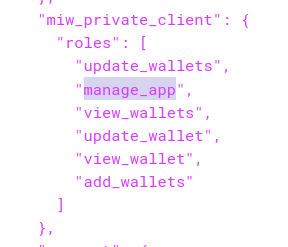

# Logging in application

Log level in application can be set using environment variable ``APP_LOG_LEVEL``. Possible values
are ``OFF, ERROR, WARN, INFO, DEBUG, TRACE`` and default value set to ``INFO``

## Change log level at runtime using Spring actuator

We can use ``/actuator/loggers`` API endpoint of actuator for log related things. This end point can be accessible with
role ``manage_app``. We can add this role to authority wallet client using keycloak as below:




1. API to get current log settings

```bash
curl --location 'http://localhost:8090/actuator/loggers' \
--header 'Authorization: Bearer access_token'
```

2. Change log level at runtime

```bash
curl --location 'http://localhost:8090/actuator/loggers/{java package name}' \
--header 'Content-Type: application/json' \
--header 'Authorization: Bearer access_token' \
--data '{"configuredLevel":"INFO"}'
```
i.e.
```bash
curl --location 'http://localhost:8090/actuator/loggers/org.eclipse.tractusx.managedidentitywallets' \
--header 'Content-Type: application/json' \
--header 'Authorization: Bearer access_token' \
--data '{"configuredLevel":"INFO"}'
```
