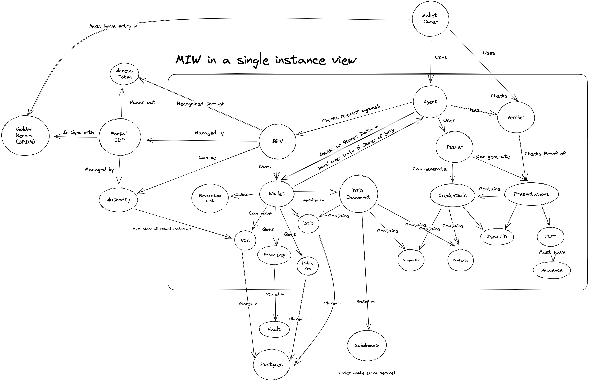

# Security Assessment Managed Identity Wallet (MIW)

|     |     |
| --- | --- |
| Contact for product        | [@OSchlienz](https://github.com/github)   [@borisrizov-zf](https://github.com/borisrizov-zf) |
| Security responsible       | [@pablosec](https://github.com/pablosec)   [@SSIRKC](https://github.com/SSIRKC) |
| Version number of product  | 23.12 |
| Dates of assessment        | 2023-11-21: Re-assessment for release 23.12 |
| Status of assessment       | RE-ASSESSMENT DRAFT |

## Product Description

The Managed Identity Wallet (MIW) service implements the Self-Sovereign-Identity (SSI) readiness by providing a wallet hosting platform including a DID resolver, service endpoints and the company wallets itself.

### Important Links
* [MIW: README.md](https://github.com/eclipse-tractusx/managed-identity-wallet/blob/main/README.md)
* [SSI: Technical Debts.md](https://github.com/eclipse-tractusx/ssi-docu/blob/main/docs/architecture/cx-3-2/6.%20Technical%20Debts/Technical%20Debts.md) – partly outdated at date of security assessment

## Existing Security Controls

ℹ️ Only controls added since last security assessment (2023-06) are listed below

* Role-based access control  
  [README.md → Manual Keycloak Configuration](https://github.com/eclipse-tractusx/managed-identity-wallet/blob/main/README.md#manual-keycloak-configuration)
  * MIW provides 7 roles:
    * `add_wallets`
    * `view_wallets`
    * `view_wallet`
    * `update_wallets`
    * `update_wallet`
    * `manage_app`
* Logging is implemented with levels `OFF`, `ERROR`, `WARN`, `INFO`, `DEBUG`, `TRACE`
  * Currently there is no description of the events logged for the different levels

## Architecture/Data Flow Diagram (DFD)

Source: https://github.com/pablosec/managed-identity-wallet/tree/main/docs

### Changes compared to last Security Assessment
[Security Assessment 2023-06, Release 3.2](https://confluence.catena-x.net/pages/viewpage.action?pageId=90482695) (Link only available to Catena-X Consortium Members)
* No architectural changes in codebase compared to last security assessment, performed in June 2023.
* Product team currently working on STS (Secure Token Service) and Presentation Flow for VC/VP, planned for rollout in version *24.05*.

### Features for upcoming versions

See also [SSI: Technical Debts.md](https://github.com/eclipse-tractusx/ssi-docu/blob/main/docs/architecture/cx-3-2/6.%20Technical%20Debts/Technical%20Debts.md)

* Revocation Service and substituting Summary Credentials (→ 24.05)
* Use of key rotation (→ 24.05)
* Switch to actually decentralized DID documents (→ will be implemented, but not scheduled at the moment)
* Create credentials outside of MIW (→ will be implemented, but not scheduled at the moment)

⚠️ Multi-tenancy will not be implemented as part of the development during the Catena-X consortium phase. Security risk associated with lack of multi-tenancy is accepted.

## Threats & Risks
The threats and risks identified during this security assessment can be found in the following issues:
* eclipse-tractusx/managed-identity-wallet#164
* eclipse-tractusx/managed-identity-wallet#165
* eclipse-tractusx/managed-identity-wallet#86 (finding was already created as issue before assessment)
* eclipse-tractusx/managed-identity-wallet#166

Security-relevant threats are reported as security advisories and thus only visible to contributers.

# NOTICE

This work is licensed under the [Apache-2.0](https://www.apache.org/licenses/LICENSE-2.0).

- SPDX-License-Identifier: Apache-2.0
- SPDX-FileCopyrightText: 2021,2023 Contributors to the Eclipse Foundation
- Source URL: https://github.com/eclipse-tractusx/managed-identity-wallet
